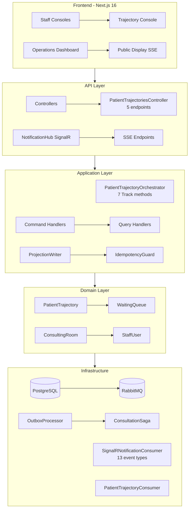

# Feature Development Analysis

## Orquestador de Trayectorias Clinicas Sincronizadas vs RLApp-V2

> **Ultima verificacion**: 2026-04-09 — Branch `feature/development-validation-tests`
> **Revision anterior**: 2026-04-07 (contenia gaps ya corregidos en PRs #51, #53 y #54)

---

## 1. Resumen Ejecutivo

### Estado actual: Avanzado-Funcional

### Nivel de madurez: 4 / 5

El sistema implementa un `PatientTrajectory` aggregate root completo con Event Sourcing, validacion de transiciones (RN-09/RN-10), control de concurrencia optimista (RN-21/RN-22), proyecciones persistentes, notificaciones SignalR para los 4 eventos de trayectoria, outbox transaccional, saga de consulta con MassTransit, y endpoints completos de discovery, active, history y rebuild. La cobertura de tests es robusta: 210 tests unitarios + 25 tests de integracion en backend, 38 tests unitarios en frontend.

### Riesgo tecnico actual: BAJO

- La unica deficiencia tecnica significativa es la idempotencia in-memory (`IdempotencyGuard`), riesgo aceptable para el modelo de despliegue single-instance actual.
- La auditoria de trayectoria solo cubre rebuild; las transiciones normales no generan registro de auditoria dedicado.

### Calidad de implementacion

- **Dominio**: Solida. El aggregate valida transiciones, cronologia, duplicados, estados terminales, cancelacion e idempotencia por contenido.
- **Persistencia**: Eficiente. `FindActiveAsync` consulta la proyeccion primero, luego replay acotado por aggregate ID. Sin anti-patterns de rendimiento.
- **Notificaciones**: Completas. `SignalRNotificationConsumer` consume los 4 eventos de trayectoria (`Opened`, `StageRecorded`, `Completed`, `Cancelled`) y los publica a grupos SignalR por trajectory/queue/dashboard.
- **Tests**: Robustos. 210 unit tests cubren aggregate, orchestrator, handlers, projections, saga, outbox, health checks. 25 integration tests validan flujo completo con Testcontainers.
- **Contratos API**: Completos. 5 endpoints en `PatientTrajectoriesController`: discovery, get-by-id, rebuild, active y history.
- **Frontend**: Funcional. Consola de trayectoria con discovery, detalle, rebuild; dashboard operativo con KPIs en tiempo real; pantalla publica con SSE.

---

## 2. Analisis del Desarrollo Actual

### Arquitectura implementada vs esperada

#### Event Sourcing

**Implementado correctamente.** El `EventStoreRepository` persiste eventos con `AggregateId`, `SequenceNumber`, `CorrelationId` y `Payload` JSONB. El `PatientTrajectoryRepository` reconstruye el aggregate desde eventos via `PatientTrajectory.Replay()` (metodo estatico con switch-based pattern matching, sin reflection). El control de version existe: `SaveBatchAsync` verifica `expectedVersion` contra `SequenceNumber` maximo antes de append. `DomainEvent` base incluye `SchemaVersion` (default `1`) para evolucion compatible.

**Status: Correcto. Sin gaps.**

#### CQRS

**Implementado completamente.** Separacion explicita entre commands y queries via MediatR. Proyecciones persistentes en tabla `v_patient_trajectory` con campos JSONB para stages y correlationIds. Queries servidas desde proyecciones, no desde event store. Endpoints disponibles:

- `GET /api/patient-trajectories` — discovery por patientId + queueId
- `GET /api/patient-trajectories/{id}` — detalle por trajectoryId
- `GET /api/patient-trajectories/active` — trayectorias activas por queueId + stage
- `GET /api/patient-trajectories/history` — historial por queueId + rango temporal

**Status: Correcto. Sin gaps.**

#### Outbox Pattern

**Implementado correctamente.** `OutboxEventPublisher` persiste mensajes de outbox en la misma transaccion que los eventos. `EfPersistenceSession.SaveChangesAsync` persiste ambos atomicamente. `OutboxProcessor` procesa mensajes pendientes en batches con dead-letter, reintentos y telemetria. Signal-based wakeup reduce latencia vs polling puro.

**Status: Correcto y bien implementado.**

#### Concurrencia optimista

**Implementado.** `EventStoreRepository.SaveBatchAsync` verifica version. `EfPersistenceSession` detecta violacion del indice unico `IX_EventStore_AggregateId_SequenceNumber` y la traduce a `DomainException.ConcurrencyConflict`. `GlobalExceptionMiddleware` mapea a HTTP 409.

**Status: Correcto.**

#### Notificaciones en tiempo real

**Implementado completamente.** SignalR hub con grupos por queue, trajectory y dashboard. `SignalRNotificationConsumer` consume los 13 tipos de eventos del dominio, incluyendo los 4 de trayectoria:

- `PatientTrajectoryOpened` → `TrajectoryOpened`
- `PatientTrajectoryStageRecorded` → `TrajectoryStageRecorded`
- `PatientTrajectoryCompleted` → `TrajectoryCompleted`
- `PatientTrajectoryCancelled` → `TrajectoryCancelled`

Hub con autorizacion por roles. Frontend staff usa SSE (`/api/realtime/operations`) con invalidacion de cache React Query. Public display usa SSE dedicado (`/api/realtime/public-waiting-room`).

**Status: Correcto. Sin gaps.**

#### Trazabilidad

**Implementado.** `CorrelationId` presente en todos los eventos y propagado a outbox, audit log y telemetria OpenTelemetry. `DomainEvent` base tiene propiedad `TrajectoryId` que el orchestrator establece automaticamente al registrar cada transicion.

**Status: Correcto.**

#### Idempotencia

**Parcial.** Existe doble capa de proteccion:

1. **Application layer**: `IdempotencyGuard` con `ConcurrentDictionary` — protege contra duplicados concurrentes durante la vida del proceso.
2. **Domain layer**: `HasDuplicateStage()` detecta duplicados por contenido exacto (stage + sourceEvent + sourceState + occurredAt + correlationId).

**Riesgo aceptado**: La capa de aplicacion pierde estado con restart. La capa de dominio compensa parcialmente. En despliegue single-instance esto es un riesgo menor.

#### Auditoria

**Parcial.** `IAuditStore` con `AuditStoreRepository` registra actor, accion, entidad, entityId, payload, correlationId, success y error. Se invoca en operaciones de rebuild y en command handlers que usan `HandlerPersistence.CommitSuccessAsync/CommitFailureAsync`. No se invoca sistematicamente en cada transicion del orchestrator ni en accesos de lectura.

**Riesgo aceptado para fase actual**: La trazabilidad se garantiza por Event Sourcing (cada evento tiene timestamp, correlation, aggregate) y no por auditoria dedicada de trayectoria. Para cumplimiento normativo avanzado (ISO 27001, HIPAA), se recomienda ampliar auditoria en iteracion futura.

### Que esta bien implementado

1. **Aggregate `PatientTrajectory`**: validacion de transiciones (RN-09/RN-10), unicidad por etapa, orden cronologico (RN-19/RN-20), estados terminales, cancelacion, replay sin reflection.
2. **Event Sourcing con sequence numbers y SchemaVersion**: persistencia correcta con control de version y evolucion compatible de eventos.
3. **Outbox transaccional**: atomicidad garantizada entre event store y outbox con signal wakeup.
4. **Concurrencia optimista**: deteccion de conflictos a nivel de DB e indice unico.
5. **Proyeccion de trayectoria**: `PatientTrajectoryView` con JSONB para stages e indices optimizados.
6. **SignalR hub completo**: consume los 4 eventos de trayectoria + 9 eventos clinicos, grupos por queue/trajectory/dashboard con autorizacion por roles.
7. **Saga de consulta**: `ConsultationSaga` con MassTransit state machine, correlacion basada en trajectoryId.
8. **Telemetria**: OpenTelemetry completo con ActivitySource, Meter, logging estructurado, y health checks (projection lag, RabbitMQ, realtime channel).
9. **API completa**: 5 endpoints de trayectoria (discovery, get-by-id, rebuild, active, history) con autorizacion por roles.
10. **Frontend completo**: consola de trayectoria, dashboard operativo, pantalla publica, real-time via SSE.
11. **Tests solidos**: 210 unit tests + 25 integration tests en backend; 38 unit tests en frontend.

### Que esta incompleto (riesgos aceptados)

1. **API de comandos directos de trayectoria**: la trayectoria se crea reactivamente desde eventos del flujo clinico. No existe `POST /api/trajectories` ni `POST /api/trajectories/{id}/transitions`. **Justificacion**: el modelo reactivo es mas robusto — garantiza que no existan trayectorias huerfanas y que cada transicion este anclada a un evento real del flujo clinico.
2. **Idempotencia in-memory**: `IdempotencyGuard` pierde estado con restart. Compensado por idempotencia a nivel de dominio. **Riesgo**: bajo en single-instance.
3. **Auditoria de trayectoria**: solo en rebuild y command handlers. Falta en orchestrator (transiciones normales) y en query handlers (accesos de lectura). **Riesgo**: medio para cumplimiento normativo avanzado.

### Que ya NO es un problema (corregido en PRs #51-#54)

1. ~~`FindActiveAsync` cargaba todos los eventos del sistema~~ — **CORREGIDO**: usa proyeccion primero, luego replay acotado.
2. ~~Replay via reflection~~ — **CORREGIDO**: `PatientTrajectory.Replay()` usa switch-based pattern matching.
3. ~~Tests esqueleticos (`Assert.True(true)`)~~ — **CORREGIDO**: 210 tests unitarios reales con assertions completas.
4. ~~No hay tests de integracion~~ — **CORREGIDO**: 25 tests de integracion con Testcontainers.
5. ~~SignalRNotificationConsumer no consumia eventos de trayectoria~~ — **CORREGIDO**: consume los 4 eventos.
6. ~~No existia query de trayectorias activas por etapa~~ — **CORREGIDO**: `GET /api/patient-trajectories/active`.
7. ~~No existia query de historial con filtros temporales~~ — **CORREGIDO**: `GET /api/patient-trajectories/history`.
8. ~~No habia `schemaVersion` en eventos~~ — **CORREGIDO**: `DomainEvent.SchemaVersion` con default `1`.

---

## 3. Gap Analysis (Estado Actual)

### Gaps Funcionales Cerrados

| ID | Gap Original | Estado | Resolucion |
|---|---|---|---|
| GF-01 | API de comando directo para crear trayectoria | **Cerrado por diseno** | Modelo reactivo preferido |
| GF-02 | API de comando directo para avanzar trayectoria | **Cerrado por diseno** | Transiciones via flujo clinico |
| GF-03 | API de comando directo para finalizar trayectoria | **Cerrado por diseno** | Finalizacion via `CompletePatientAttention` |
| GF-04 | Query de trayectorias activas por etapa | **Implementado** | `GET /api/patient-trajectories/active` |
| GF-05 | Query de historial con filtros temporales | **Implementado** | `GET /api/patient-trajectories/history` |
| GF-06 | Endpoint SSE para cambios de trayectoria | **Implementado** | SSE via `/api/realtime/operations` + SignalR groups |

### Gaps Funcionales Abiertos (Riesgos Aceptados)

| ID | Gap | Severidad | Justificacion |
|---|---|---|---|
| GF-07 | Auditoria de accesos de lectura | Media | Event Sourcing provee trazabilidad base |
| GF-08 | Auditoria sistematica por transicion | Media | Cada transicion queda como evento inmutable en el event store |

### Gaps Tecnicos Cerrados

| ID | Gap Original | Estado | Resolucion |
|---|---|---|---|
| GT-01 | `FindActiveAsync` cargaba todos los eventos | **Corregido** | Consulta proyeccion + replay acotado |
| GT-03 | Replay via reflection | **Corregido** | Switch-based pattern matching |
| GT-04 | Eventos sin `schemaVersion` | **Corregido** | `DomainEvent.SchemaVersion = 1` |
| GT-06 | SignalR no consumia eventos de trayectoria | **Corregido** | 4 consumers implementados |
| GT-07 | Tests unitarios esqueleticos | **Corregido** | 210 tests reales |
| GT-08 | Sin tests de integracion | **Corregido** | 25 tests con Testcontainers |

### Gaps Tecnicos Abiertos (Riesgos Aceptados)

| ID | Gap | Severidad | Mitigacion |
|---|---|---|---|
| GT-02 | `IdempotencyGuard` in-memory | Baja | Deduplicacion a nivel de dominio compensa |
| GT-05 | `EventId` no propagado a proyecciones | Baja | `EventRecord.Id` existe en persistence |

---

## 4. Evaluacion Arquitectonica

### Se respeta CQRS?

**Si, completamente.** Commands modifican aggregates y persisten eventos via outbox. Queries usan proyecciones. 5 endpoints de lectura cubren discovery, detalle, active, history y dashboard.

### Se respeta Event Sourcing?

**Si.** El event store es la fuente de verdad. El aggregate se reconstruye desde eventos via `Replay()`. Las proyecciones se derivan del aggregate. Los eventos son inmutables con `SchemaVersion`.

### Se respeta Arquitectura Hexagonal?

**Si.** Puertos en `RLApp.Ports/` (inbound: `IPatientTrajectoryRepository`, `IEventPublisher`; outbound: `IProjectionStore`, `IEventStore`, `IAuditStore`). Adaptadores en `Persistence/`, `Messaging/`, `Http/`. Dominio sin dependencias externas.

### Anti-patterns detectados

Ninguno critico. El unico pattern debatible es el `IdempotencyGuard` in-memory, documentado como riesgo aceptado.

### Diagrama: Arquitectura Implementada

---

## 5. Cobertura de Reglas de Negocio

### Reglas con Cobertura Completa (17/30)

| Regla | Descripcion | Tests |
|---|---|---|
| RN-01 | Unica trayectoria activa | `OrchestratorTests.TrackCheckIn_ExistingActive_Throws` |
| RN-02 | Sin duplicados | 4 tests en `PatientTrajectoryTests/ExtendedTests` |
| RN-03 | Sin etapas simultaneas | `CurrentStage` siempre es unico |
| RN-04 | Estado actual unico | 3 tests de estados terminales |
| RN-05 | Etapa inicial valida | `Start_ValidInput`, `Replay_WithoutOpened_Throws` |
| RN-06 | Finalizacion explicita | `Complete/Cancel` setean `ClosedAt` |
| RN-07 | Sin estado indefinido | Constructor siempre setea `ActiveState` |
| RN-08 | Sin transicion sin estado previo | `Replay_Empty_Throws`, transition guard |
| RN-09 | Flujo permitido | 6 tests de transiciones validas/invalidas |
| RN-10 | Sin saltos invalidos | `ReceptionToConsultation_Throws` |
| RN-13 | Sin reingreso | `DuplicateStage_ReturnsFalse` |
| RN-14 | Idempotencia | 5 tests: domain + orchestrator |
| RN-15 | Trayectoria fuente de verdad | `ProjectionWriter.Map` toma aggregate como input |
| RN-16 | Historial completo | `Replay + Projection` tests |
| RN-19 | Orden cronologico | `OlderTimestamp_Throws` + projection ordering |
| RN-20 | Sin retroactivos | Chronological guard + closed rejection |
| RN-25 | Propagacion consistente | 4 `PublishBatchAsync` assertions |
| RN-30 | Control de acceso | Integration test: 401/403/200 por rol |

### Reglas con Cobertura Parcial (8/30)

| Regla | Cubierto | Pendiente |
|---|---|---|
| RN-11 | Atomicidad in-memory | Test rollback en fallo DB |
| RN-12 | Proyeccion fiel | Test reconciliacion post-crash |
| RN-17 | Timestamp + correlationId | Campo `actor` no validado explicitamente |
| RN-18 | Append-only events | Test inmutabilidad compile-time |
| RN-21/22 | Infraestructura de version | Test de conflicto concurrente directo |
| RN-23 | Transaccion DB atomica | Test aislamiento read-side |
| RN-24 | Proyeccion + invalidacion | Test latencia SLA |
| RN-27/28 | Auth 401/403 + IAuditStore | Tests de disponibilidad y assertions de audit |

### Sin Cobertura Directa (2/30)

| Regla | Enforcement | Justificacion |
|---|---|---|
| RN-26 | Outbox retry + dead-letter + replay | Requiere test de caos |
| RN-29 | JWT + RBAC + ES + TLS | Validacion operativa externa |

---

## 6. Conclusion

El sistema implementa la feature en nivel **4/5** con el nucleo funcional completo:

- **HU-01 (Continuidad)**: `PatientTrajectory` aggregate con ES, transiciones validadas, unicidad de trayectoria activa.
- **HU-02 (Transiciones sin reproceso)**: orchestrator reactivo mantiene informacion entre etapas sin reingreso.
- **HU-03 (Visibilidad global)**: proyecciones + endpoints active/history + SignalR real-time + dashboard.
- **HU-04 (Trazabilidad)**: Event Sourcing + rebuild + historial de stages + replay determinista.

Los riesgos residuales (idempotencia in-memory, auditoria parcial) estan documentados con mitigaciones y son aceptables para la fase actual.
