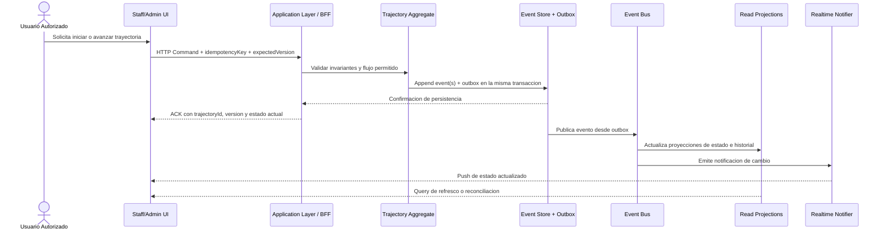
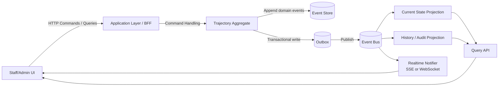
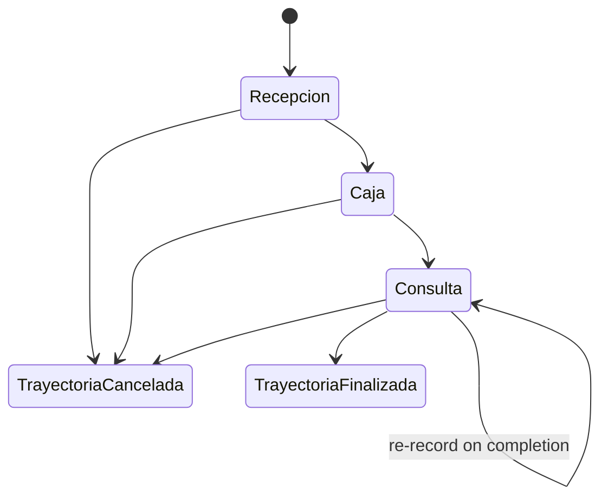
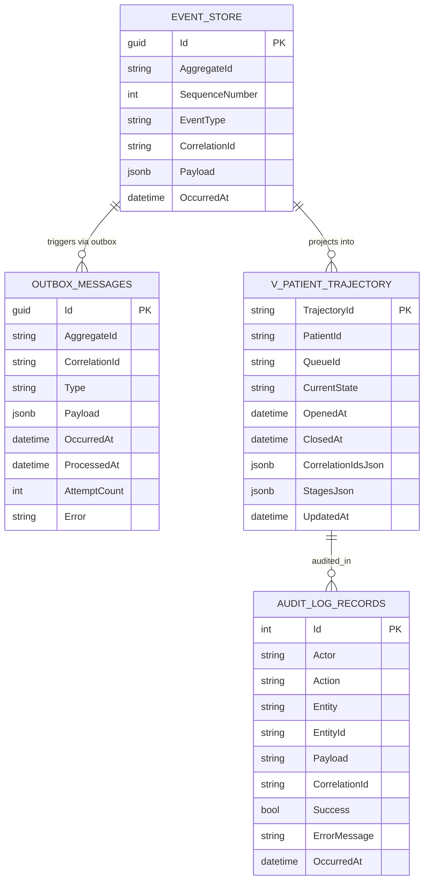

# Feature Development Spec

## 1. Overview

### Nombre de la feature

Orquestador de Trayectorias Clinicas Sincronizadas

### Problema que resuelve

El sistema actual gestiona etapas clinicas de forma fragmentada. Esto genera falta de continuidad en la atencion, reprocesos administrativos, baja visibilidad del estado global del paciente y latencias operativas de hasta 5 segundos en la actualizacion de la interfaz.

### Objetivo tecnico

Implementar una orquestacion distribuida, persistente y trazable de la trayectoria del paciente usando una trayectoria unica como fuente de verdad, con transiciones consistentes, publicacion de eventos, proyecciones de lectura optimizadas y propagacion de cambios en tiempo cercano a real.

### Impacto en el sistema

- Introduce un aggregate root central de trayectoria por paciente.
- Refuerza Event Sourcing y CQRS como base operacional.
- Reemplaza el modelo de sincronizacion dependiente de polling por propagacion basada en eventos y push a UI.
- Agrega controles explicitos de concurrencia, idempotencia, auditoria e inmutabilidad.
- Habilita visibilidad operativa y trazabilidad historica sin reprocesar informacion clinica.

## 2. Alcance

### In Scope

- Gestion de una trayectoria unica y activa por paciente.
- Inicio explicito de trayectoria desde una etapa valida.
- Transiciones de etapa consistentes, atomicas e idempotentes.
- Persistencia del historial completo de eventos de trayectoria.
- Proyecciones de lectura para estado actual y trazabilidad historica.
- Actualizacion de UI en tiempo cercano a real mediante push basado en eventos.
- Controles de concurrencia optimista.
- Auditoria de accesos y acciones relevantes.
- Restricciones de acceso basadas en rol para datos clinicos y operativos.

### Out of Scope

- Cambios estructurales mayores al sistema de facturacion; caja se trata como etapa del flujo, no como rediseño del modulo.
- Reemplazo total de la infraestructura actual mas alla de los ajustes necesarios para reducir latencia y soportar el modelo orientado a eventos.
- Definicion de procesos clinicos adicionales fuera de admision, espera, consulta medica, caja y finalizacion.
- Cambios funcionales no relacionados con trayectoria, auditoria, sincronizacion y visibilidad operativa.

### Supuestos

- La infraestructura actual puede soportar el incremento de procesamiento y almacenamiento.
- El sistema de mensajeria puede ajustarse sin afectar la operacion actual.
- Las interfaces del personal pueden consumir actualizaciones en tiempo real.
- Los modulos actuales de admision, medico y caja pueden integrarse sin cambios funcionales mayores.

### Restricciones

- Debe existir una sola trayectoria activa por paciente.
- No se permiten estados intermedios visibles al usuario.
- Toda transicion debe ser atomica y auditable.
- La solucion debe cumplir requisitos de confidencialidad, integridad y disponibilidad.
- La lectura puede ser eventualmente consistente, pero el desfase no debe superar los limites definidos en NFR.

## 3. Flujos de Usuario y Sistema

### Flujos principales

1. Inicio de trayectoria
   El sistema crea una trayectoria unica para un paciente desde una etapa inicial valida, persiste el evento inicial, registra metadatos de actor, timestamp y correlacion, y publica el cambio para proyecciones y notificaciones.

2. Transicion de etapa sin reproceso
   Un usuario autorizado solicita avanzar a la siguiente etapa. El comando valida trayectoria activa, estado previo, flujo permitido, version esperada e idempotencia. Si la transicion es valida, se persiste un nuevo evento y se propaga el cambio.

3. Monitoreo operativo del estado global
   Un administrador consulta el estado actual de multiples pacientes sobre una proyeccion optimizada. La UI recibe cambios en tiempo cercano a real cuando se procesan eventos de trayectoria.

4. Consulta de historial y auditoria
   Un administrador consulta la trayectoria completa de un paciente. La respuesta se construye desde historial inmutable y/o proyecciones historicas sin afectar el rendimiento del flujo transaccional.

### Edge cases

- Dos solicitudes simultaneas intentan iniciar una trayectoria para el mismo paciente.
- Dos usuarios intentan mover al mismo paciente desde la misma version de trayectoria.
- El cliente reintenta un comando despues de timeout sin saber si la operacion se confirmo.
- Un consumidor de eventos falla temporalmente y debe reanudar sin duplicar efectos.
- La conexion en tiempo real de la UI se interrumpe y luego se restablece.
- La lectura refleja retraso transitorio respecto al lado de escritura.

### Casos de error

- Creacion rechazada por trayectoria activa existente.
- Transicion rechazada por flujo invalido o ausencia de estado previo.
- Conflicto de concurrencia por version inesperada.
- Acceso denegado por rol no autorizado.
- Consulta de historial para trayectoria inexistente.
- Retraso de proyeccion por falla temporal del bus o del consumidor.

### Diagrama de secuencia



## 4. Arquitectura Tecnica

### Componentes del sistema

- Staff/Admin UI: interfaz de operacion y monitoreo.
- Application Layer / BFF: recibe comandos y queries, aplica autorizacion y coordina casos de uso.
- Trajectory Aggregate: fuente de verdad para reglas, transiciones e invariantes.
- Event Store: persistencia inmutable de eventos de trayectoria.
- Outbox transaccional: desacopla persistencia de publicacion y evita perdida de eventos.
- Event Bus: distribuye cambios a consumidores.
- Current State Projection: modelo de lectura para estado global y monitoreo.
- History/Audit Projection: modelo de lectura para trazabilidad y auditoria.
- Realtime Notifier: canal push a UI via SSE o WebSocket.

### Comunicacion

- Sync
  - UI -> BFF para comandos y consultas.
  - BFF -> Aggregate para validacion y ejecucion del caso de uso.

- Async
  - Event Store/Outbox -> Event Bus para publicacion confiable.
  - Event Bus -> Projections para consistencia eventual controlada.
  - Event Bus -> Realtime Notifier para propagacion a UI.

### Patrones aplicados

- Event Sourcing para historial inmutable y reconstruccion de estado.
- CQRS para desacoplar escritura transaccional de lectura optimizada.
- Outbox Pattern para publicacion confiable de eventos.
- Control de concurrencia optimista basado en version.
- Idempotencia en comandos y consumidores.
- Auditoria separada del historial de dominio para cumplimiento y seguridad.

### Diagrama de arquitectura



## 5. Diseno de Dominio (DDD)

### Aggregate principal

- Trajectory
  - Aggregate root que representa el flujo completo de una atencion.
  - Mantiene el estado actual, la referencia al paciente, la version y el historial de eventos aplicables.
  - Es la unica autoridad para validar inicio, transiciones y finalizacion.

### Entidades

- Patient
  - Identificador unico.
  - Datos basicos de identificacion.
  - No contiene estado clinico dinamico.

- TrajectoryEvent
  - Unidad minima de cambio persistente.
  - Inmutable.
  - Incluye actor, timestamp, correlacion y secuencia/version.

- AuditRecord
  - Registro de seguridad y acceso.
  - Complementa, pero no reemplaza, los eventos de dominio.

### Value Objects

- TrajectoryId
- PatientId
- Stage
- TrajectoryStatus
- Actor
- CorrelationId
- IdempotencyKey
- Version
- Timestamp

### Invariantes

- Un paciente no puede tener mas de una trayectoria activa.
- No pueden existir trayectorias duplicadas para la misma atencion activa.
- Toda trayectoria tiene un estado actual unico.
- No existe transicion sin estado previo.
- Las transiciones deben respetar el flujo permitido.
- No se permiten saltos invalidos.
- La transicion es atomica.
- El historial es inmutable y cronologico.
- No existen estados intermedios visibles.
- Toda operacion relevante es auditable.

### Maquina de estados

Nota: Las etapas reales implementadas en el sistema son `Recepcion`, `Caja` y `Consulta`. La nomenclatura en codigo es en espanol. `Consulta` puede re-registrarse (para admission de etapa en completion). La trayectoria soporta dos estados terminales: `TrayectoriaFinalizada` y `TrayectoriaCancelada`.



Notas:

- Las etapas corresponden a las constantes `ReceptionStage`, `CashierStage`, `ConsultationStage` del aggregate.
- Cualquier transicion fuera de la secuencia definida debe rechazarse (RN-09/RN-10).
- `TrayectoriaFinalizada` y `TrayectoriaCancelada` son estados terminales.
- Una trayectoria cancelada no puede completarse y viceversa.

## 6. Contratos

### API

#### 1. Crear trayectoria

`POST /api/trajectories`

Request:

```json
{
  "patientId": "string",
  "initialStage": "ADMISSION",
  "actor": {
    "id": "string",
    "role": "SYSTEM | RECEPTIONIST | ADMIN"
  },
  "correlationId": "string",
  "idempotencyKey": "string"
}
```

Response `201 Created`:

```json
{
  "trajectoryId": "string",
  "patientId": "string",
  "currentStage": "ADMISSION",
  "status": "ACTIVE",
  "version": 1,
  "correlationId": "string"
}
```

#### 2. Avanzar trayectoria

`POST /api/trajectories/{trajectoryId}/transitions`

Request:

```json
{
  "fromStage": "WAITING",
  "toStage": "MEDICAL_CONSULTATION",
  "expectedVersion": 2,
  "actor": {
    "id": "string",
    "role": "RECEPTIONIST | DOCTOR | ADMIN"
  },
  "correlationId": "string",
  "idempotencyKey": "string"
}
```

Response `200 OK`:

```json
{
  "trajectoryId": "string",
  "patientId": "string",
  "previousStage": "WAITING",
  "currentStage": "MEDICAL_CONSULTATION",
  "status": "ACTIVE",
  "version": 3,
  "correlationId": "string"
}
```

#### 3. Finalizar trayectoria

`POST /api/trajectories/{trajectoryId}/complete`

Request:

```json
{
  "expectedVersion": 4,
  "actor": {
    "id": "string",
    "role": "ADMIN | SYSTEM"
  },
  "correlationId": "string",
  "idempotencyKey": "string"
}
```

Response `200 OK`:

```json
{
  "trajectoryId": "string",
  "status": "COMPLETED",
  "version": 5,
  "completedAt": "2026-04-08T15:04:05Z"
}
```

#### 4. Consultar trayectoria activa por paciente

`GET /api/patients/{patientId}/active-trajectory`

Response `200 OK`:

```json
{
  "trajectoryId": "string",
  "patientId": "string",
  "currentStage": "WAITING",
  "status": "ACTIVE",
  "version": 2,
  "lastUpdatedAt": "2026-04-08T15:04:05Z"
}
```

#### 5. Consultar estado global operativo

`GET /api/trajectories/active?stage={stage}&updatedAfter={timestamp}`

Response `200 OK`:

```json
{
  "items": [
    {
      "trajectoryId": "string",
      "patientId": "string",
      "currentStage": "WAITING",
      "status": "ACTIVE",
      "lastUpdatedAt": "2026-04-08T15:04:05Z"
    }
  ]
}
```

#### 6. Consultar historial de trayectoria

`GET /api/trajectories/{trajectoryId}/history?from={timestamp}&to={timestamp}`

Response `200 OK`:

```json
{
  "trajectoryId": "string",
  "patientId": "string",
  "events": [
    {
      "eventName": "TrajectoryStarted",
      "stage": "ADMISSION",
      "occurredAt": "2026-04-08T15:04:05Z",
      "actor": {
        "id": "string",
        "role": "SYSTEM"
      },
      "correlationId": "string",
      "version": 1
    }
  ]
}
```

#### 7. Suscripcion a cambios en tiempo real

`GET /api/trajectories/stream`

Semantica:

- Canal SSE o equivalente para cambios de estado.
- Debe soportar reconexion y reanudacion desde ultimo evento recibido cuando la tecnologia lo permita.
- No reemplaza la query de reconciliacion; la UI debe poder resincronizarse consultando el read model.

### Codigos de error

- `400 Bad Request`: payload invalido, etapa invalida, datos obligatorios ausentes.
- `401 Unauthorized`: identidad no autenticada.
- `403 Forbidden`: rol sin permisos para la operacion.
- `404 Not Found`: trayectoria o paciente no encontrado.
- `409 Conflict`: trayectoria activa duplicada o conflicto de concurrencia por version.
- `422 Unprocessable Entity`: transicion no permitida o invariantes de dominio violadas.
- `503 Service Unavailable`: indisponibilidad temporal de componentes de publicacion o consulta.

### Eventos

#### Evento 1: `PatientTrajectoryOpened`

Payload (alineado con implementacion real):

```json
{
  "eventType": "PatientTrajectoryOpened",
  "aggregateId": "TRJ-QUEUE1-PAT1-20260408150405000",
  "patientId": "string",
  "queueId": "string",
  "occurredAt": "2026-04-08T15:04:05Z",
  "correlationId": "string",
  "trajectoryId": "string | null"
}
```

#### Evento 2: `PatientTrajectoryStageRecorded`

Payload:

```json
{
  "eventType": "PatientTrajectoryStageRecorded",
  "aggregateId": "TRJ-QUEUE1-PAT1-20260408150405000",
  "patientId": "string",
  "queueId": "string",
  "stage": "Caja",
  "sourceEvent": "PatientPaymentValidated",
  "sourceState": "EnEsperaConsulta",
  "occurredAt": "2026-04-08T15:05:00Z",
  "correlationId": "string"
}
```

#### Evento 3: `PatientTrajectoryCompleted`

Payload:

```json
{
  "eventType": "PatientTrajectoryCompleted",
  "aggregateId": "TRJ-QUEUE1-PAT1-20260408150405000",
  "patientId": "string",
  "queueId": "string",
  "stage": "Consulta",
  "sourceEvent": "PatientAttentionCompleted",
  "sourceState": "Finalizado",
  "occurredAt": "2026-04-08T15:10:00Z",
  "correlationId": "string"
}
```

#### Evento 4: `PatientTrajectoryCancelled`

Payload:

```json
{
  "eventType": "PatientTrajectoryCancelled",
  "aggregateId": "TRJ-QUEUE1-PAT1-20260408150405000",
  "patientId": "string",
  "queueId": "string",
  "sourceEvent": "PatientAbsentAtCashier",
  "sourceState": "CanceladoPorAusencia",
  "reason": "string | null",
  "occurredAt": "2026-04-08T15:06:00Z",
  "correlationId": "string"
}
```

#### Evento 5: `PatientTrajectoryRebuilt`

Payload:

```json
{
  "eventType": "PatientTrajectoryRebuilt",
  "aggregateId": "TRJ-QUEUE1-PAT1-20260408150405000",
  "patientId": "string",
  "queueId": "string",
  "scope": "string",
  "occurredAt": "2026-04-08T15:12:00Z",
  "correlationId": "string"
}
```

### Versionado de eventos

- **Estado actual**: los eventos NO incluyen `schemaVersion`. Esta pendiente como gap GT-04.
- **Objetivo**: agregar propiedad `SchemaVersion` a cada evento de trayectoria con valor default `1`.
- Cambios breaking requieren nuevo nombre de evento o nueva version mayor.
- Consumidores deben tolerar campos adicionales no breaking.

### Idempotencia

- Cada comando debe incluir `idempotencyKey` unica por intento logico.
- La escritura debe deduplicar por combinacion de contexto de negocio e idempotencyKey.
- Cada evento debe tener `eventId` unico.
- Los consumidores deben registrar el ultimo evento procesado o un registro de deduplicacion para evitar reprocesos.

## 7. Modelo de Datos

### Estructura de datos (alineada con implementacion real)

#### Tabla `EventStore` (event store global)

- `Id` PK (Guid)
- `AggregateId` (string, max 128) - incluye trajectory ID para eventos de trayectoria
- `SequenceNumber` (int) - version por aggregate stream
- `EventType` (string, max 256)
- `CorrelationId` (string, max 128)
- `Payload` (jsonb) - evento serializado completo
- `OccurredAt` (datetime)

#### Tabla `OutboxMessages`

- `Id` PK (Guid)
- `AggregateId` (string, max 128)
- `CorrelationId` (string, max 128)
- `Type` (string, max 256)
- `Payload` (jsonb)
- `OccurredAt` (datetime)
- `ProcessedAt` (datetime, nullable)
- `AttemptCount` (int, default 0)
- `Error` (string, nullable)

#### Tabla `v_patient_trajectory` (proyeccion)

- `TrajectoryId` PK (string)
- `PatientId` (string)
- `QueueId` (string)
- `CurrentState` (string) - TrayectoriaActiva | TrayectoriaFinalizada | TrayectoriaCancelada
- `OpenedAt` (datetime)
- `ClosedAt` (datetime, nullable)
- `CorrelationIdsJson` (jsonb) - array de correlationIds
- `StagesJson` (jsonb) - array de stages con OccurredAt, Stage, SourceEvent, SourceState, CorrelationId
- `UpdatedAt` (datetime)

#### Tabla `AuditLogRecords` (auditoria generica)

- `Id` PK
- `Actor` (string)
- `Action` (string)
- `Entity` (string)
- `EntityId` (string)
- `Payload` (string, JSON)
- `CorrelationId` (string)
- `Success` (bool)
- `ErrorMessage` (string, nullable)
- `OccurredAt` (datetime)

Nota: No existe tabla `patients` independiente ni tabla `trajectories` separada del event store. El estado de la trayectoria se reconstruye via replay desde el event store o se lee desde la proyeccion `v_patient_trajectory`.

### Relaciones

- Un paciente puede tener multiples trayectorias historicas (multiples streams en el event store).
- Una trayectoria activa pertenece a un unico paciente (invariante validada en el orchestrator).
- Una trayectoria tiene multiples eventos en su stream del event store.
- Un paciente puede tener multiples registros de auditoria.

### Indices (implementados)

- Unico sobre `EventStore(AggregateId, SequenceNumber)` para orden estricto y deteccion de concurrencia.
- Indice sobre `EventStore(AggregateId, OccurredAt)`.
- Indice sobre `EventStore(CorrelationId)` para trazabilidad transversal.
- Indice sobre `EventStore(EventType, OccurredAt)` para consultas por tipo.
- Indice sobre `v_patient_trajectory(PatientId)`.
- Indice sobre `v_patient_trajectory(QueueId)`.
- Indice compuesto sobre `v_patient_trajectory(PatientId, QueueId, CurrentState)` para busqueda de activas.
- Indice sobre `OutboxMessages(ProcessedAt)` para processor.
- Indice sobre `OutboxMessages(CorrelationId)` para trazabilidad.

### Indices pendientes (recomendados)

- Indice parcial sobre `v_patient_trajectory(PatientId)` donde `CurrentState = 'TrayectoriaActiva'` para garantizar unicidad de trayectoria activa a nivel de DB.
- Tabla de idempotencia persistente con indice unico sobre `key`.

### Diagrama ER (alineado con persistencia real)



## 8. Reglas de Negocio

### Validaciones

- Debe existir exactamente una trayectoria activa por paciente.
- Toda trayectoria debe iniciar desde una etapa valida.
- Toda transicion requiere estado previo existente.
- La etapa destino debe pertenecer al flujo permitido.
- La informacion ya registrada debe reutilizarse y no solicitarse nuevamente.
- Todo evento debe incluir timestamp, actor e identificador correlacionable.

### Restricciones

- No se permiten trayectorias duplicadas.
- No se permite que un paciente este en multiples etapas simultaneamente.
- No se permiten modificaciones retroactivas del historial.
- No se permiten estados indefinidos.
- No se permiten saltos de etapa fuera del flujo autorizado.
- No se debe exponer al usuario un estado parcialmente aplicado.

### Transiciones validas

- (inicio) -> Recepcion
- Recepcion -> Caja
- Caja -> Consulta
- Consulta -> Consulta (re-record al completar)
- Consulta -> TrayectoriaFinalizada (finalizacion explicita)
- Cualquier etapa activa -> TrayectoriaCancelada (cancelacion explicita)

### Restricciones de consistencia

- La version del aggregate debe incrementarse con cada cambio.
- Si `expectedVersion` no coincide, la operacion debe fallar con conflicto.
- El lado de lectura puede quedar temporalmente atrasado, pero nunca debe reconstruir un estado invalido.
- Las proyecciones deben aplicar eventos en orden y ser reejecutables sin efectos duplicados.

## 9. NFRs

### Rendimiento

- Actualizacion de estado visible en UI en menos de 500 ms.
- Procesamiento de transicion en menos de 200 ms en condiciones normales.
- Propagacion de eventos con retraso maximo menor a 1 segundo.
- Consultas operativas optimizadas sobre read models, no sobre reconstruccion completa por defecto.

### Concurrencia

- Control de concurrencia optimista obligatorio sobre trayectoria.
- Operaciones simultaneas sobre el mismo paciente no deben producir doble trayectoria ni transiciones inconsistentes.
- Las operaciones deben ser idempotentes ante reintentos.

### Escalabilidad

- Escalado horizontal de consumidores y componentes de lectura.
- Capacidad de crecimiento independiente de lectura y escritura.
- Soporte para aumento de pacientes concurrentes sin degradacion significativa.

### Seguridad

- Cifrado en transito via HTTPS/TLS.
- Control de acceso por roles.
- Auditoria de accesos y modificaciones.
- Proteccion de datos sensibles frente a acceso no autorizado.
- Trazabilidad suficiente para cumplimiento con ISO 27001, HIPAA, GDPR y Ley 1581.

### Disponibilidad

- Objetivo de disponibilidad minima de 99.9%.
- Fallos en consumidores o mensajeria no deben corromper la fuente de verdad.
- Reintentos y recuperacion controlada en publicacion y consumo de eventos.

## 10. Testing para Desarrollo

### Unit tests necesarios

- Creacion de trayectoria con etapa inicial valida.
- Rechazo de segunda trayectoria activa para el mismo paciente.
- Rechazo de transicion sin estado previo.
- Rechazo de salto invalido de etapas.
- Incremento correcto de version tras cada evento.
- Finalizacion explicita desde estado permitido.
- Idempotencia de comando con misma `idempotencyKey`.

### Integration tests

- Persistencia de evento y outbox en una misma transaccion.
- Publicacion de eventos desde outbox sin perdida.
- Actualizacion de current state projection ante eventos ordenados.
- Reproceso seguro de eventos en history projection.
- Disponibilidad de historial completo para auditoria.
- Propagacion de cambios a canal SSE/WebSocket.
- Reconciliacion UI tras reconexion y consulta de refresh.

### Casos criticos

#### Concurrencia

- Dos comandos validos compiten por la misma trayectoria y solo uno se confirma por version.
- Dos solicitudes intentan crear trayectoria activa para el mismo paciente y una debe fallar.

#### Idempotencia

- Reenvio del mismo comando tras timeout devuelve resultado consistente sin duplicar evento.
- Reprocesamiento del mismo evento no altera indebidamente la proyeccion.

#### Consistencia eventual

- La query puede mostrar estado anterior de forma transitoria, pero converge al estado final correcto.
- La UI recibe push y luego verifica consistencia contra read model.

### Cobertura de pruebas recomendada

- Dominio: alta cobertura sobre invariantes y transiciones.
- Integracion: cobertura obligatoria de outbox, publicacion, proyecciones y consulta de historial.
- No funcionales: pruebas focalizadas de latencia, concurrencia y resiliencia en la mensajeria.

## 11. Plan de Implementacion

Nota: Los pasos marcados con [DONE] ya estan implementados en RLApp-V2. Los marcados con [GAP] requieren trabajo. Ver `feature-development-analysis.md` para detalles.

1. [DONE] Modelar el dominio de trayectoria, estados, actores e invariantes.
2. [DONE] Implementar el aggregate `PatientTrajectory` con Event Sourcing y versionado.
3. [DONE] Definir y persistir eventos de dominio con metadatos de correlacion.
4. [DONE] Implementar persistencia transaccional de eventos y outbox.
5. [DONE] Publicar eventos al bus desde outbox con reintentos seguros y dead-letter.
6. [DONE] Construir proyeccion de estado actual (`v_patient_trajectory`).
7. [DONE] Exponer API de queries (discovery, get-by-id, rebuild).
8. [DONE] Implementar notificaciones en tiempo real via SignalR hub.
9. [DONE] Implementar control de concurrencia optimista.
10. [DONE] Implementar saga de consulta con MassTransit.
11. [GAP/CRITICO] Eliminar anti-pattern `GetAllAsync` en `FindActiveAsync` — usar proyeccion.
12. [GAP/CRITICO] Migrar idempotencia a persistencia duradera.
13. [GAP] Refactorizar replay del aggregate sin reflection.
14. [GAP] Implementar comandos directos de trayectoria (crear, avanzar, finalizar).
15. [GAP] Exponer endpoints API para comandos directos.
16. [GAP] Implementar query de trayectorias activas por etapa.
17. [GAP] Implementar query de historial con filtros temporales.
18. [GAP] Agregar `schemaVersion` a eventos de trayectoria.
19. [GAP] Consumir eventos de trayectoria en SignalR consumer.
20. [GAP] Implementar auditoria sistematica por transicion y acceso.
21. [GAP] Implementar o documentar canal SSE para cambios de trayectoria.
22. [GAP/CRITICO] Escribir tests unitarios reales del aggregate y orchestrator.
23. [GAP] Escribir tests de integracion para outbox, proyeccion y concurrencia.
24. [GAP] Validar NFRs de latencia, consistencia eventual y recuperacion.

## 12. CI/CD + Definition of Done

### Requisitos para merge

- Especificacion y contratos versionados en repositorio.
- Pruebas unitarias e integracion en verde.
- Validaciones de concurrencia e idempotencia ejecutadas.
- Validacion de seguridad y control de acceso completada.
- Evidencia de latencia y propagacion dentro de umbrales definidos.

### Quality gates

- Build exitoso.
- Linter/format validado segun stack.
- Tests unitarios obligatorios.
- Tests de integracion obligatorios para outbox, proyecciones y queries.
- Contract tests para API y eventos.
- Verificacion de migraciones y restricciones de datos.
- Verificacion de observabilidad: logs, correlationId y auditoria presentes.

### Validaciones minimas

- No hay duplicacion de trayectorias activas.
- No hay transiciones invalidas aceptadas.
- No hay eventos perdidos entre persistencia y publicacion.
- La UI converge al estado correcto despues de reconexion.
- El historial es completo, cronologico e inmutable.

### Definition of Done

- Dominio implementado y cubierto por pruebas.
- Contratos API y eventos estables y documentados.
- Proyecciones operativas e historicas funcionando.
- Actualizacion en tiempo real validada.
- Controles de concurrencia, idempotencia y auditoria verificados.
- NFRs criticos medidos y dentro de umbrales aceptables.

## 13. Riesgos Tecnicos

1. Backlog en outbox o event bus puede aumentar la latencia de UI.
   Mitigacion: monitoreo de lag, reintentos controlados y escalado de consumidores.

2. Conflictos frecuentes de concurrencia pueden degradar la experiencia operativa.
   Mitigacion: control optimista con respuestas claras y reintentos seguros en cliente cuando aplique.

3. Consumidores no idempotentes pueden corromper proyecciones.
   Mitigacion: deduplicacion por `eventId` y pruebas de reproceso.

4. Proyecciones desalineadas pueden mostrar estados transitorios incorrectos.
   Mitigacion: aplicacion ordenada por secuencia, reconciliacion y monitoreo de consistencia.

5. Exposicion de datos clinicos en canales de consulta o tiempo real.
   Mitigacion: RBAC, minimizacion de payload y auditoria de accesos.

6. Restricciones insuficientes a nivel de datos pueden permitir doble trayectoria activa.
   Mitigacion: combinar invariantes de dominio con indice unico parcial.

7. La historia completa puede crecer rapidamente y degradar consultas.
   Mitigacion: read models optimizados, indices adecuados y consultas por rango.

## 14. Checklist Final

- [ ] Dominio implementado
- [ ] Aggregate `Trajectory` implementado con versionado
- [ ] Restriccion de trayectoria activa unica validada
- [ ] Eventos correctos y versionados
- [ ] Outbox transaccional implementado
- [ ] Proyecciones operativas implementadas
- [ ] Proyecciones historicas y auditoria implementadas
- [ ] Idempotencia validada
- [ ] Concurrencia validada
- [ ] Consistencia eventual validada
- [ ] API y contratos documentados
- [ ] Canal de tiempo real implementado
- [ ] Tests unitarios completos
- [ ] Tests de integracion completos
- [ ] Logs, correlationId y trazabilidad presentes
- [ ] Seguridad y control por roles verificados
