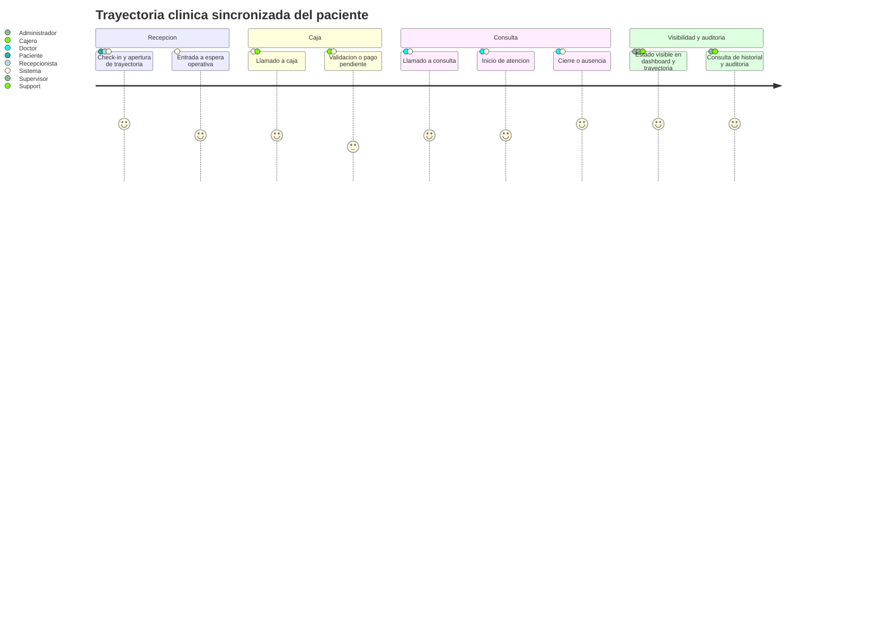
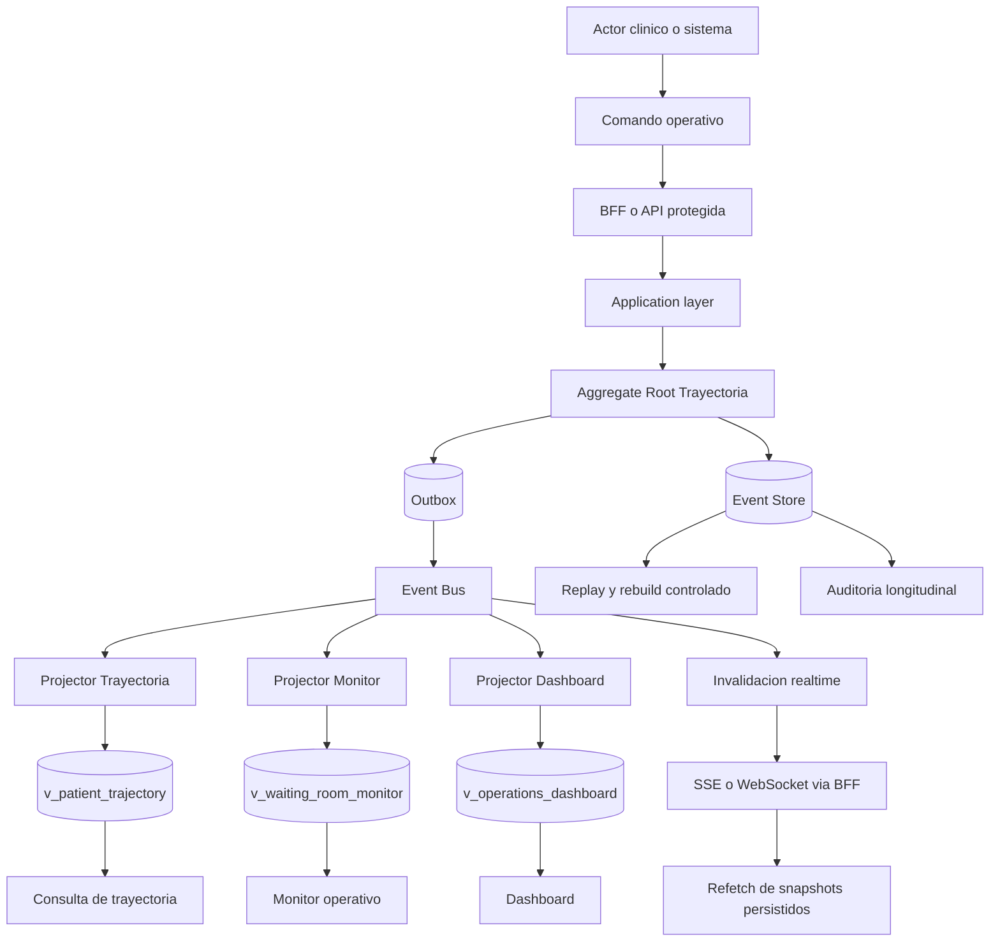
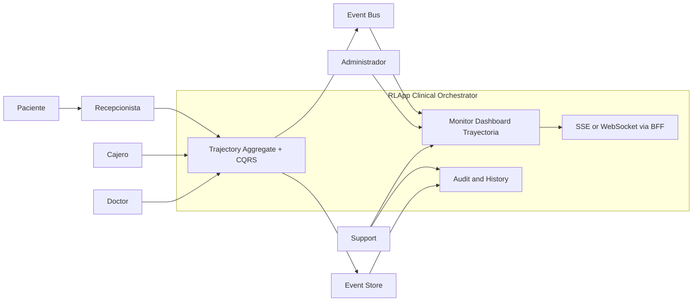

# PRD - QA Perspective

## Executive summary

La feature `Orquestador de Trayectorias Clinicas Sincronizadas` cambia el foco del sistema RLApp desde una operacion fragmentada por etapa hacia una orquestacion longitudinal basada en una trayectoria unica por paciente. Desde perspectiva QA, este cambio no solo agrega funcionalidad: redefine el modelo de riesgo del producto, porque desplaza la verdad operativa a una cadena distribuida compuesta por comandos, eventos, almacenamiento inmutable, proyecciones, invalidacion realtime y auditoria.

El objetivo QA principal es verificar que la trayectoria siga siendo la fuente unica de verdad bajo reintentos, concurrencia, propagacion asincronica, fallos parciales de mensajeria y recuperacion desde replay, manteniendo confidencialidad, integridad, disponibilidad y evidencia auditiva suficiente para contextos clinicos regulados.

## QA analysis of the clinical flow

### Business-critical quality goals

- continuidad del paciente sin trayectorias activas duplicadas
- trazabilidad completa del recorrido desde admision hasta cierre
- ausencia de reprocesos funcionales y de duplicidad de datos
- visibilidad operacional sincronizada en menos de 500 ms como objetivo de experiencia
- soporte a auditoria clinica y regulatoria mediante historial inmutable
- resistencia a fallos parciales del bus, del outbox y del lado read model

### QA view of the distributed architecture

El riesgo funcional no vive en un solo endpoint. La calidad depende de la consistencia de una cadena completa:

1. el actor emite un comando operativo
2. el aggregate de trayectoria valida invariantes y expected version
3. los eventos quedan persistidos y registrados en outbox
4. el bus distribuye los eventos a consumidores y proyectores
5. las proyecciones materializan trayectoria, monitor y dashboard
6. el frontend sincronizado recibe invalidacion y hace refetch de snapshots persistidos
7. la auditoria puede reconstruir el recorrido sin mutar historia ni exponer datos indebidos

Un defecto en cualquiera de estos pasos puede provocar impacto clinico u operativo aunque el API primario responda `200`.

## Critical QA validation points

| Area | What must be true | Why it is critical |
| --- | --- | --- |
| Unicidad | Solo existe una trayectoria activa por paciente y contexto valido | Evita fragmentacion, doble atencion y errores de seguimiento |
| Atomicidad | Una transicion valida deja un estado consistente o falla completa | Evita estados intermedios visibles y deriva operativa |
| Idempotencia | Reintentos no duplican trayectoria, hitos ni jobs de rebuild | Reintentos son normales en sistemas distribuidos |
| Orden de eventos | Historial y proyecciones preservan orden logico y cronologico | Auditoria y reconstruccion dependen de ello |
| Concurrencia optimista | Escrituras simultaneas generan conflicto controlado, no corrupcion | El flujo clinico puede recibir acciones paralelas |
| Eventual consistency | El read model converge sin drift bloqueante | La UI toma decisiones sobre snapshots, no sobre write-side |
| Seguridad | Roles, BFF y SSE no amplian permisos ni exponen token | Riesgo regulatorio y de privacidad |
| Auditoria | Cada evento tiene actor, timestamp y correlacion | Soporte a investigacion clinica y regulatoria |

## Technical risk register

| Risk ID | Risk | Trigger | Business impact | QA focus |
| --- | --- | --- | --- | --- |
| R-01 | Race condition on transitions | dos actores cambian la trayectoria a la vez | estado inconsistente o doble cierre | pruebas concurrentes y conflicto de version |
| R-02 | Duplicate event publication | retry de outbox o consumidor | hitos duplicados y metricas erroneas | idempotencia de proyectores y handlers |
| R-03 | Projection lag | retraso en outbox o bus | UI muestra estado viejo | medicion de convergencia y drift |
| R-04 | Messaging failure | broker degradado o desconectado | write-side correcto con read-side obsoleto | chaos testing y replay controlado |
| R-05 | Read/write divergence | bug en projector o evento fuera de orden | auditoria y monitor difieren | comparacion entre trayectoria, monitor y dashboard |
| R-06 | Replay side effects | rebuild reemite efectos operativos | eventos legacy alterados o dobles acciones | pruebas dry-run e idempotencia |
| R-07 | RBAC bypass | rol invalido, sesion expirada o header legacy | acceso no autorizado a datos clinicos | pruebas `401`, `403`, BFF y SSE |
| R-08 | Token leakage in browser | mala mediacion del frontend | incumplimiento HIPAA/GDPR/Ley 1581 | inspeccion de session endpoints y realtime |

## Regulatory and compliance QA posture

Esta feature requiere evidencia alineada con principios de:

- `ISO 27001`: controles de acceso, trazabilidad y gestion de eventos de seguridad
- `HIPAA`: minimo acceso necesario y proteccion de informacion sensible
- `GDPR`: minimizacion de datos y control de exposicion en interfaces y eventos
- `Ley 1581`: tratamiento autorizado y protegido de datos personales

Desde QA, esto se traduce en cuatro obligaciones:

1. demostrar RBAC efectivo
2. demostrar historial inmutable y auditable
3. demostrar no exposicion de secretos ni `accessToken` en navegador
4. demostrar que un incidente de consistencia eventual no deja informacion clinica corrupta o irrecuperable

## Diagram - Patient user journey

## Diagram - Complete system flow

## Diagram - System context

## QA decision statement

La feature es testeable y automatizable, pero no es segura para declararse lista con un enfoque funcional superficial. La estrategia QA debe modelar el sistema como una cadena distribuida donde write-side, outbox, event bus, read models, frontend sincronizado y auditoria son partes del mismo contrato de negocio.
