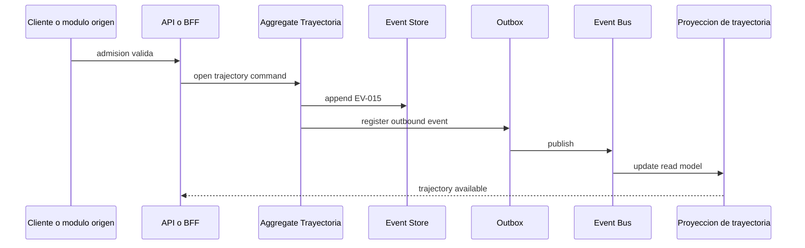
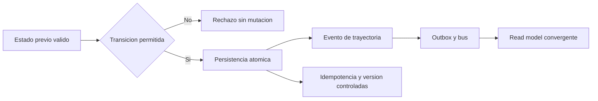
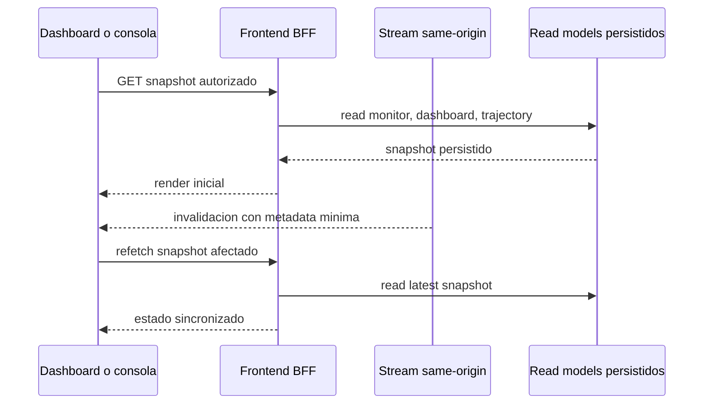
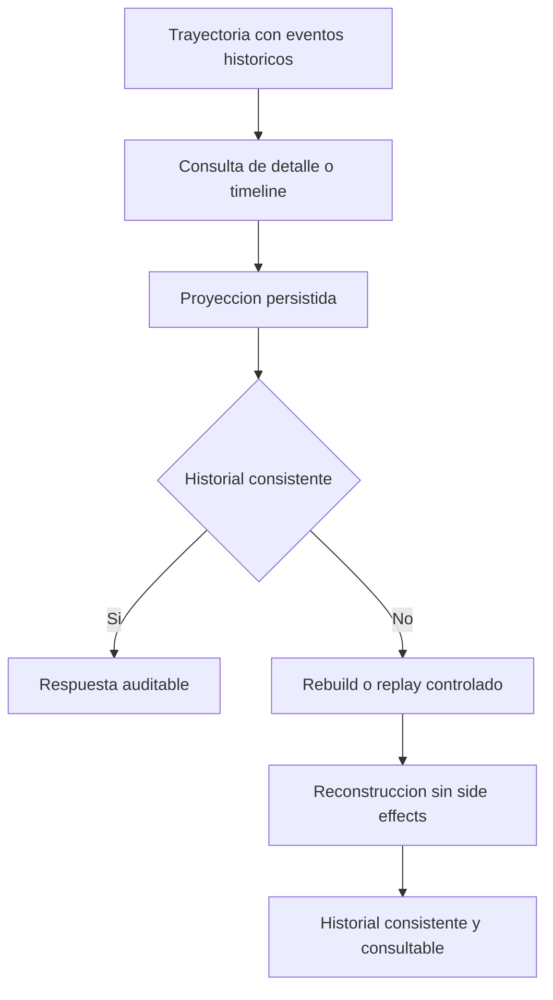

# User Stories and Acceptance Criteria - Expanded

## Purpose

Reescribir las historias de usuario de la feature en formato orientado a prueba, incorporando escenarios positivos, negativos, concurrencia, idempotencia y fallos de eventos.

## Interpretation note

Las historias se redactan en lenguaje de negocio y se validan contra el comportamiento real de RLApp: trayectoria unica, transiciones operativas por recepcion/caja/consulta, proyecciones persistidas, BFF y sincronizacion realtime same-origin.

## HU-01 - Continuidad del paciente

### HU-01 Gherkin

```gherkin
Feature: Continuidad del paciente sobre una trayectoria unica

  Scenario: Apertura nominal de trayectoria unica en la primera interaccion valida
    Given un paciente sin trayectoria activa en la cola operativa
    When el sistema registra la admision valida del paciente
    Then se crea una unica trayectoria activa para el paciente
    And la trayectoria queda con un estado actual unico
    And la trayectoria se convierte en la fuente de verdad del flujo posterior

  Scenario: Rechazo de trayectoria duplicada por apertura repetida
    Given un paciente ya posee una trayectoria activa valida
    When llega un nuevo intento de apertura para el mismo paciente y contexto
    Then el sistema impide crear una segunda trayectoria activa
    And registra el intento de forma auditable

  Scenario: Conflicto controlado ante apertura concurrente
    Given dos solicitudes concurrentes intentan abrir trayectoria para el mismo paciente
    When ambas se procesan casi al mismo tiempo
    Then solo una solicitud consolida la trayectoria activa
    And la otra recibe conflicto controlado o correlacion al recurso existente
    And no quedan trayectorias activas duplicadas

  Scenario: Reintento idempotente de apertura
    Given una solicitud valida de apertura ya fue aceptada
    When el cliente reintenta la misma operacion con la misma clave de idempotencia
    Then el sistema no crea una trayectoria nueva
    And devuelve un resultado equivalente al ya consolidado

  Scenario: Falla de publicacion de evento sin perdida de integridad write-side
    Given la trayectoria fue creada correctamente en el write-side
    And la publicacion al bus falla temporalmente
    When el sistema reintenta la propagacion asincronica
    Then la trayectoria sigue existiendo como unica fuente de verdad
    And la recuperacion no duplica eventos ni trayectorias
```

### HU-01 Acceptance criteria expansion

- CA-01 se valida con apertura nominal, apertura repetida y concurrencia.
- CA-02 se valida con rechazo explicito o reutilizacion segura del recurso existente.
- CA-03 se valida asegurando que la primera etapa siempre sea una apertura valida derivada de una accion operativa aceptada.
- CA-04 se valida comparando write-side, proyeccion de trayectoria y visibilidad operacional.
- CA-05 se valida con conflictos de version y comportamiento idempotente.

### HU-01 Flow diagram



## HU-02 - Transiciones sin reproceso

### HU-02 Gherkin

```gherkin
Feature: Transiciones sin reproceso ni perdida de contexto

  Scenario: Transicion nominal conserva informacion del paciente
    Given una trayectoria activa con informacion previa consistente
    When el actor autorizado ejecuta una transicion valida entre etapas permitidas
    Then la informacion ya registrada se conserva sin reprocesos
    And el nuevo hito queda agregado a la trayectoria

  Scenario: Rechazo de salto invalido entre etapas
    Given una trayectoria se encuentra en una etapa actual valida
    When un actor intenta moverla a una etapa no permitida por el flujo
    Then la transicion es rechazada
    And no se persiste ningun estado intermedio visible

  Scenario: Conflicto controlado en transiciones concurrentes
    Given dos actores intentan transicionar la misma trayectoria desde la misma version
    When ambos comandos compiten por persistirse
    Then una transicion resulta exitosa
    And la otra falla por control de concurrencia optimista
    And el historial final conserva consistencia cronologica

  Scenario: Reintento idempotente de transicion
    Given una transicion valida ya fue aceptada
    When el mismo comando se reintenta con la misma clave funcional
    Then no se registra un hito duplicado
    And el estado resultante permanece estable

  Scenario: Falla de proyeccion despues de una transicion exitosa
    Given el write-side acepta una transicion valida
    And la actualizacion del read model se retrasa o falla temporalmente
    When el sistema recupera la propagacion desde outbox o replay controlado
    Then el read model converge al estado correcto
    And no se pierde ni se duplica el hito de trayectoria
```

### HU-02 Acceptance criteria expansion

- CA-01 se valida con comparacion antes y despues del cambio de etapa.
- CA-02 se valida con payloads repetidos y campos ya existentes.
- CA-03 se valida con una sola accion funcional por transicion y sin workflows manuales paralelos.
- CA-04 se valida con reintentos de transporte, usuario y middleware.
- CA-05 se valida con matriz de transiciones permitidas y no permitidas.

### HU-02 Flow diagram



## HU-03 - Visibilidad del estado global

### HU-03 Gherkin

```gherkin
Feature: Visibilidad sincronizada del estado global del paciente

  Scenario: Visualizacion nominal del estado actual en tiempo cercano a real
    Given existen trayectorias activas y proyecciones persistidas actualizadas
    When el administrador consulta el dashboard o la vista operacional
    Then observa la etapa actual de cada paciente autorizadamente
    And el estado visible converge en menos del umbral operativo esperado

  Scenario: Rechazo de acceso a usuario no autorizado
    Given un usuario sin rol permitido intenta acceder a la vista operacional
    When consulta el dashboard o el stream protegido
    Then recibe una respuesta de autorizacion fallida
    And no obtiene datos clinicos visibles del paciente

  Scenario: Multiples pacientes se actualizan sin mezclar contexto
    Given varios pacientes avanzan por etapas diferentes al mismo tiempo
    When las proyecciones y el stream procesan las invalidaciones
    Then la vista global mantiene separacion correcta por paciente
    And no hay contaminacion cruzada de estado entre registros

  Scenario: Evento realtime duplicado no duplica el estado visible
    Given el frontend recibe dos invalidaciones equivalentes del mismo recurso
    When ejecuta el refetch seguro del snapshot persistido
    Then el estado visible no se duplica ni cambia incorrectamente
    And la vista sigue derivando del read model persistido

  Scenario: Reconexion tras interrupcion del canal realtime
    Given la interfaz pierde temporalmente la conexion del stream
    When el canal se recupera
    Then la UI se reconecta
    And hace refetch de los snapshots afectados desde read models persistidos
    And el estado permanece consistente con la ultima proyeccion autorizada
```

### HU-03 Acceptance criteria expansion

- CA-01 se valida en monitor, dashboard y vista de trayectoria.
- CA-02 se valida con latencia de convergencia y no solo con tiempo de respuesta del API.
- CA-03 se valida comparando lo visible con la trayectoria persistida.
- CA-04 se valida con volumen y actualizaciones simultaneas.
- CA-05 se valida con desconexion, reconexion e invalidacion same-origin.

### HU-03 Flow diagram



## HU-04 - Trazabilidad del recorrido

### HU-04 Gherkin

```gherkin
Feature: Trazabilidad y auditoria longitudinal del paciente

  Scenario: Consulta nominal del historial completo
    Given una trayectoria del paciente ya fue abierta y recorrida por varias etapas
    When un actor autorizado consulta el historial longitudinal
    Then obtiene el recorrido completo con orden cronologico garantizado
    And cada hito contiene timestamp, actor o correlacion identificable y evento fuente

  Scenario: Rechazo de modificacion retroactiva del historial
    Given existe un historial ya persistido e inmutable
    When un proceso intenta alterar retrospectivamente un hito consolidado
    Then la operacion es rechazada o ignorada segun el contrato
    And la evidencia auditiva permanece integra

  Scenario: Lectura concurrente durante transiciones activas
    Given una trayectoria esta siendo actualizada mientras otro actor la consulta
    When la consulta ocurre sobre proyeccion persistida y auditable
    Then el historial visible mantiene orden y consistencia
    And no expone estados intermedios corruptos

  Scenario: Rebuild idempotente del historial
    Given el soporte solicita reconstruccion controlada de una trayectoria historica
    When repite la misma solicitud con la misma clave de idempotencia
    Then el sistema no crea un segundo rebuild efectivo para el mismo alcance
    And el resultado auditado sigue siendo consistente

  Scenario: Recuperacion de historial tras falla de proyeccion
    Given el detalle de trayectoria o timeline auditado presenta divergence temporal
    When se ejecuta replay o rebuild controlado sobre el alcance afectado
    Then el historial vuelve a ser consultable sin alterar eventos legacy
    And se conserva la inmutabilidad del event store
```

### HU-04 Acceptance criteria expansion

- CA-01 se valida con detalle completo, timeline y filtros por contexto autorizado.
- CA-02 se valida con timestamps y orden monotono.
- CA-03 se valida con imposibilidad de mutar eventos historicos.
- CA-04 se valida con consultas para auditoria por trayectoria, paciente y correlacion.
- CA-05 se valida midiendo que las consultas no requieran replay en hot path.

### HU-04 Flow diagram


