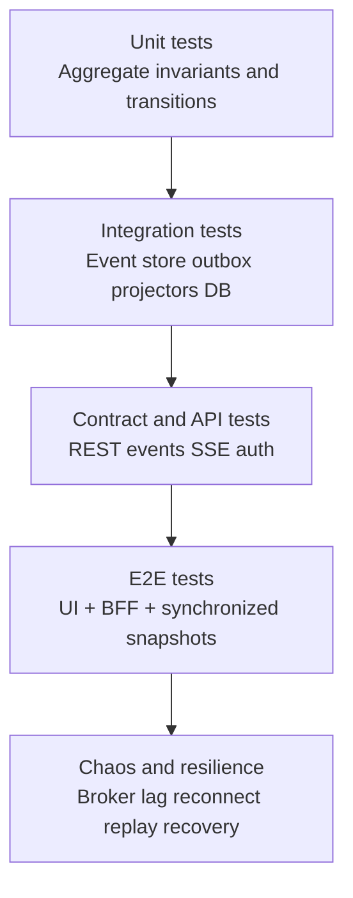
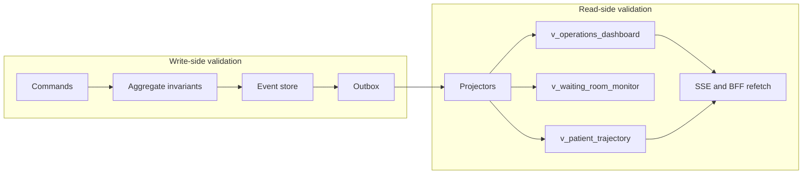
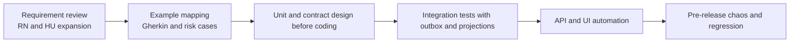

# Test Strategy

## Purpose

Definir la estrategia de pruebas de una feature distribuida basada en Event Sourcing, CQRS, outbox, event bus y sincronizacion realtime, priorizando testabilidad del dominio, convergencia entre write/read model y automatizacion sostenible.

## Quality objectives

- validar invariantes del aggregate de trayectoria
- validar integridad de persistencia inmutable y expected version
- validar contratos HTTP, eventos y snapshots de lectura
- validar comportamiento funcional bajo reintentos, concurrencia y fallos parciales
- validar seguridad, auditoria y no exposicion de token en navegador

## Test principles

- el write-side es la fuente primaria de verdad y su correccion no depende de la UI
- el read-side no se valida solo por presencia de datos, sino por convergencia y ausencia de drift
- las pruebas deben cubrir orquestacion completa, no solo endpoints aislados
- los defectos mas costosos son de consistencia, concurrencia y seguridad; por eso tienen prioridad superior
- los escenarios negativos y de recuperacion son obligatorios

## Test types and objectives

| Layer | Primary target | Main failure mode | Core evidence |
| --- | --- | --- | --- |
| Unit tests | aggregate, value objects, invariantes | reglas violadas, expected version incorrecta | eventos emitidos, transiciones rechazadas |
| Integration tests | event store, outbox, projectors, DB | perdida de persistencia, drift, side effects | writes atomicos y proyecciones coherentes |
| Contract tests | REST schemas, event envelopes, SSE payloads | cambio no compatible de contrato | validacion de schema y backward compatibility |
| API tests | comandos y consultas protegidas | RBAC, idempotencia, errores semanticos | status, body, canonical errors |
| E2E tests | flujo clinico de usuario | roto funcional visible o drift de UI | trayectorias, dashboard, mensajes, estados |
| Chaos tests | bus, outbox, reconnect, replay | degradacion bajo fallo parcial | convergencia y recuperacion |

## Unit testing strategy

Se deben probar de forma exhaustiva:

- unicidad de trayectoria activa
- apertura valida y rechazo de aperturas duplicadas
- matriz de transiciones permitidas y prohibidas
- cierre terminal por finalizacion o ausencia
- idempotencia del aggregate ante eventos o comandos repetidos segun el modelo usado
- control de concurrencia optimista via version o expected version
- inmutabilidad del historial una vez consolidado el evento

## Integration testing strategy

Se deben probar los puntos donde una regla de dominio puede degradarse por infraestructura:

- append correcto de eventos y version monotona
- escritura atomica entre event store y outbox
- publicacion al bus sin side effects duplicados
- recuperacion de proyecciones tras fallos temporales
- rebuild dry-run y rebuild real sin mutar eventos legacy
- convergencia de `v_patient_trajectory`, `v_waiting_room_monitor` y `v_operations_dashboard`

## Contract testing strategy

El objetivo no es solo validar JSON correcto. Se debe detectar drift contractual en:

- `GET /api/patient-trajectories`
- `GET /api/patient-trajectories/{trajectoryId}`
- `POST /api/patient-trajectories/rebuild`
- endpoints de sesion protegida del frontend
- envelopes realtime same-origin para invalidacion de snapshots

## API testing strategy

Los flujos API deben cubrir:

- discovery positivo y vacio
- detalle cronologico por `trajectoryId`
- rebuild con `SupportOnly`
- errores canonicos `401`, `403`, not found y scope invalid
- conflictos por concurrencia o expected version cuando el caso aplique
- reintentos idempotentes y duplicate submissions

## E2E testing strategy

Los flujos E2E deben cubrir:

- acceso autenticado a la consola de trayectoria
- render correcto del estado vacio y del camino positivo
- convergencia entre acciones operativas, dashboard y trayectoria
- reconexion realtime con refetch de snapshots
- restricciones de rol sobre vistas y operaciones sensibles

## Chaos and resilience strategy

Las pruebas de caos no son opcionales en esta feature. Se deben simular al menos:

- caida temporal del broker
- retraso artificial en outbox processor
- duplicacion de entrega de eventos
- desconexion de canal realtime
- rebuild sobre alcance parcial mientras existen lecturas concurrentes

## Diagram - Event-driven testing pyramid

## Diagram - Testing layers: write-side vs read-side

## Diagram - Shift-left strategy

## Exit heuristics

La estrategia no debe considerarse ejecutada si falta cualquiera de estos puntos:

- cobertura de concurrencia optimista
- cobertura de idempotencia
- cobertura de RBAC y no exposicion de token
- evidencia de convergencia entre write-side y read-side
- evidencia de recuperacion tras fallos parciales
