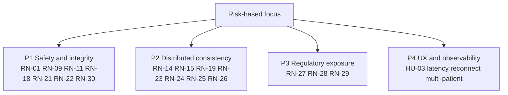

# Test Plan

## Purpose

Planificar la ejecucion de pruebas para la feature `Orquestador de Trayectorias Clinicas Sincronizadas`, definiendo alcance por historia, ambientes, estrategia de datos y stack de herramientas para pruebas funcionales, distribuidas y regulatorias.

## Traceability baseline

- HUs: `HU-01`, `HU-02`, `HU-03`, `HU-04`
- Reglas: `RN-01` a `RN-30`
- NFR: latencia, consistencia eventual controlada, disponibilidad, seguridad, auditoria
- Contratos actuales: discovery, query, rebuild y vistas sincronizadas de RLApp

## Scope by user story

| HU | Scope included | Scope excluded |
| --- | --- | --- |
| HU-01 | apertura unica, duplicados, concurrencia, idempotencia, expected version | cancelacion voluntaria fuera del contrato vigente |
| HU-02 | transiciones validas, integridad de datos, retries, no reproceso | variantes de facturacion fuera del flujo simulado actual |
| HU-03 | dashboard, monitor, trayectoria, SSE/BFF, multi-paciente | display publico anonimo fuera de la feature protegida |
| HU-04 | historial, auditabilidad, rebuild, replay controlado, orden cronologico | mutaciones retroactivas de historial que el sistema no soporta por diseno |

## Test objectives

- detectar corrupcion de trayectoria unica
- detectar errores en propagacion de eventos y actualizacion de proyecciones
- detectar fugas de seguridad en interfaces protegidas
- medir convergencia operacional bajo carga moderada y alta
- producir evidencia defendible para auditoria y Go/No-Go

## Environments

| Environment | Purpose | Topology | Mandatory checks |
| --- | --- | --- | --- |
| Dev local | desarrollo y debugging de reglas | backend + frontend + DB + broker locales | tests unitarios, integracion focalizada, contract checks |
| Staging | validacion funcional integrada | stack completo con BFF y mensajeria | API, E2E, SSE, RBAC, convergencia |
| Prod-like | decision de salida | despliegue equivalente a produccion con datos sinteticos | carga, chaos, replay, auditoria, KPIs |

## Data strategy

### Test data categories

- pacientes nominales con flujo completo
- pacientes con pago pendiente y reintento
- pacientes ausentes en caja o consulta
- pacientes con trayectoria historica para discovery multi-queue
- usuarios por rol: `Receptionist`, `Cashier`, `Doctor`, `Supervisor`, `Support`
- idempotency keys y correlation IDs deterministas para trazabilidad

### Data management rules

- el event store se considera evidencia y no debe mutarse retroactivamente
- los datos sinteticos deben permitir replay y reconstruccion repetible
- los tests de concurrencia deben usar pacientes o trayectorias controladas para aislar efectos
- los escenarios de SSE deben validar snapshots persistidos despues de cada invalidacion

### Replay and mock policy

- no mockear el aggregate para pruebas de negocio
- mockear servicios externos no nucleares solo cuando no afecten la verdad operativa
- para fallos de mensajeria se prefieren entornos controlados o chaos injection sobre mocks triviales

## Tools

| Layer | Tooling |
| --- | --- |
| Backend unit | `.NET 10`, `xUnit 2.9.3`, `NSubstitute 5.3.0`, `FluentAssertions 8.x` |
| Backend integration | `Testcontainers.PostgreSql`, `Testcontainers.RabbitMq`, `WebApplicationFactory` |
| Frontend unit | `vitest 4.1.3`, `@testing-library/react`, `@testing-library/jest-dom` |
| Frontend E2E smoke | `role-smoke.mjs` (Node.js script, login + role verification) |
| Synthetic load and drift checks | Docker Compose + harness Node (`rlapp-patient-simulation.mjs`) + k6 |
| Contract and schema validation | schema checks JSON y validacion de envelopes de eventos |
| Static analysis | CodeQL (C# + JS), `lizard` (complejidad ciclomatica), `gitleaks` (secrets) |

## Execution waves

1. wave-1: unit and integration on aggregate, event store and outbox
2. wave-2: contract and API validation on discovery, query and rebuild
3. wave-3: UI validation on trajectory console and synchronized visibility
4. wave-4: resilience, replay, reconnect and drift validation
5. wave-5: prod-like regression, load and release gating

## Entry criteria

- historias y reglas refinadas aprobadas
- contratos reales identificados
- ambientes disponibles y credenciales seguras configuradas
- suites base compilando en verde

## Exit criteria

- defects criticos cerrados o aceptados formalmente
- KPIs dentro de umbral o con excepcion aprobada
- cobertura suficiente sobre RN, seguridad, concurrencia e historial
- evidencia de automatizacion y evidencia manual consolidada

## Diagram - Coverage map by component

```mermaid
flowchart TD
    A[Trajectory Aggregate] --> A1[Unit tests — xUnit]
    A --> A2[Concurrency tests — backlog]
    B[Event Store and Outbox] --> B1[Integration tests — Testcontainers]
    B --> B2[Replay and rebuild tests — unit + integration]
    C[Trajectory APIs] --> C1[Contract tests — integration]
    C --> C2[RBAC validation — integration]
    D[Read Models] --> D1[Projection consistency tests — unit + integration]
    D --> D2[Audit chronology tests — integration]
    E[Frontend BFF and UI] --> E1[Unit tests — vitest]
    E --> E2[Role smoke — Node.js script]
    E --> E3[SSE reconnect tests — simulation harness]
```

## Diagram - Risk-based testing prioritization

## Planning note

El mayor retorno de QA no esta en aumentar el numero bruto de casos, sino en asegurar que los casos de P1 y P2 fallen cuando realmente se rompa la consistencia distribuida del sistema.
