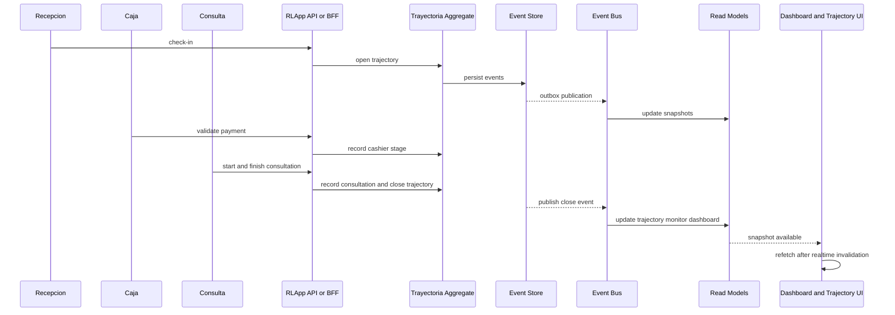

# Test Scenarios

## Purpose

Definir el catalogo de escenarios de prueba de la feature, cubriendo el flujo completo del paciente, transiciones invalidas, concurrencia, reconstruccion de estado, auditoria y degradaciones tipicas de una arquitectura event-driven.

## Scenario catalog

| Scenario ID | Name | Type | Main target | Expected evidence |
| --- | --- | --- | --- | --- |
| SCN-01 | Flujo nominal completo del paciente | E2E | continuidad y cierre correcto | trayectoria finalizada, monitor convergente, auditoria consistente |
| SCN-02 | Rechazo de trayectoria duplicada | API + domain | unicidad | una sola trayectoria activa |
| SCN-03 | Transicion invalida entre etapas | API + domain | matriz de transiciones | error semantico sin estado intermedio |
| SCN-04 | Concurrencia de doble transicion | integration | optimistic concurrency | un ganador, un conflicto controlado |
| SCN-05 | Reintento idempotente de comando | API | idempotencia | misma respuesta o mismo efecto, sin duplicados |
| SCN-06 | Falla temporal de event bus | resilience | write-side vs read-side | persistencia correcta y convergencia posterior |
| SCN-07 | Replay y rebuild dry-run | resilience | reconstruccion controlada | dry-run aceptado, sin side effects |
| SCN-08 | Divergencia temporal de proyecciones | integration | eventual consistency | drift transitorio observable y luego corregido |
| SCN-09 | Historial completo y cronologico | query + audit | trazabilidad | etapas ordenadas, actor y timestamp |
| SCN-10 | Rechazo de mutacion retroactiva | domain + security | inmutabilidad | historial no alterado |
| SCN-11 | RBAC en vistas y operaciones | API + UI | `401` y `403` | acceso restringido por rol y sesion |
| SCN-12 | Reconexion de SSE o WebSocket | UI + resilience | visibilidad sincronizada | refetch de snapshots autorizados |
| SCN-13 | Multi-paciente sin contaminacion cruzada | E2E + UI | aislamiento de contexto | cada paciente conserva su estado |
| SCN-14 | Duplicacion de eventos en consumidor | integration + chaos | idempotencia de proyecciones | no se duplican hitos ni estados visibles |

## Detailed scenarios

### SCN-01 - Flujo nominal completo del paciente

- Preconditions: paciente valido, cola activa, consultorio elegible, usuarios por rol disponibles.
- Steps:
  1. registrar admision
  2. ejecutar llamada y validacion de caja
  3. ejecutar llamada a consulta, inicio y cierre
  4. consultar trayectoria, monitor y dashboard
- Expected result: trayectoria `Finalizada`, estados visibles terminales coherentes y evidencia auditable completa.

### SCN-02 - Rechazo de trayectoria duplicada

- Preconditions: existe una trayectoria activa para el paciente.
- Steps:
  1. reenviar solicitud de apertura para el mismo paciente y contexto
  2. consultar discovery y detalle
- Expected result: no aparece una nueva trayectoria activa y el sistema devuelve conflicto o correlacion segura.

### SCN-03 - Transicion invalida entre etapas

- Preconditions: trayectoria activa en una etapa inicial conocida.
- Steps:
  1. intentar una transicion no soportada por el flujo
  2. consultar write-side y read-side
- Expected result: rechazo semantico, sin eventos mutantes nuevos y sin estado intermedio visible.

### SCN-04 - Concurrencia de doble transicion

- Preconditions: dos actores o procesos comparten la misma version inicial de la trayectoria.
- Steps:
  1. disparar transiciones validas competidoras en paralelo
  2. capturar respuestas y versiones resultantes
  3. consultar historial final
- Expected result: un solo camino se consolida, el otro falla controladamente y la cronologia sigue integra.

### SCN-05 - Reintento idempotente de comando

- Preconditions: clave de idempotencia controlada por el cliente.
- Steps:
  1. enviar un comando valido
  2. reenviarlo con la misma clave y payload funcional equivalente
  3. inspeccionar respuestas e historial
- Expected result: mismo efecto observable, sin hitos duplicados ni jobs repetidos.

### SCN-06 - Falla temporal de event bus

- Preconditions: write-side funcional y canal de mensajeria degradado.
- Steps:
  1. ejecutar una transicion valida
  2. bloquear o retrasar la propagacion al bus
  3. restablecer la comunicacion
  4. consultar snapshots persistidos
- Expected result: write-side correcto desde el inicio y convergencia posterior de read models sin duplicidad.

### SCN-07 - Replay y rebuild dry-run

- Preconditions: actor `Support` autenticado y alcance de rebuild definido.
- Steps:
  1. solicitar rebuild con `dryRun = true`
  2. repetir la solicitud con la misma clave de idempotencia
  3. consultar estado o evidencia del job
- Expected result: aceptacion controlada, mismo `jobId` o mismo alcance efectivo y cero side effects operativos.

### SCN-08 - Divergencia temporal de proyecciones

- Preconditions: carga o retraso artificial en outbox o projectors.
- Steps:
  1. ejecutar transiciones de negocio
  2. observar un desfase temporal entre write-side y read-side
  3. medir tiempo de convergencia
- Expected result: drift transitorio no bloqueante y recuperacion dentro del umbral definido.

### SCN-09 - Historial completo y cronologico

- Preconditions: trayectoria historica con varias etapas.
- Steps:
  1. consultar detalle por `trajectoryId`
  2. extraer timestamps, eventos fuente y correlaciones
  3. validar orden
- Expected result: historial completo, monotono e inmutable.

### SCN-10 - Rechazo de mutacion retroactiva

- Preconditions: historial consolidado y actor sin capacidad de mutacion retroactiva.
- Steps:
  1. intentar modificar un hito historico o reconstruirlo de forma invalida
  2. volver a consultar historial
- Expected result: no se altera la evidencia previamente consolidada.

### SCN-11 - RBAC en vistas y operaciones

- Preconditions: usuarios validos por rol y casos sin autenticacion.
- Steps:
  1. consumir discovery, detalle, rebuild, session endpoints y stream protegido sin sesion
  2. repetir con rol invalido
- Expected result: `401` o `403` segun corresponda, sin fuga de datos ni bypass por headers legacy.

### SCN-12 - Reconexion de SSE o WebSocket

- Preconditions: vista de trayectoria o dashboard abierta y stream activo.
- Steps:
  1. provocar desconexion temporal
  2. seguir procesando cambios en backend
  3. observar reconexion y refetch
- Expected result: la UI recupera sincronizacion usando snapshots persistidos.

### SCN-13 - Multi-paciente sin contaminacion cruzada

- Preconditions: multiples pacientes activos en estados diferentes.
- Steps:
  1. ejecutar transiciones entremezcladas para varios pacientes
  2. consultar monitor, dashboard y trayectoria
- Expected result: ninguna entrada hereda estados, correlaciones o destinos de otro paciente.

### SCN-14 - Duplicacion de eventos en consumidor

- Preconditions: consumidor o projector recibe dos veces el mismo evento.
- Steps:
  1. reinyectar el mismo evento o simular redelivery
  2. consultar proyecciones y trayectoria
- Expected result: idempotencia efectiva del consumidor y ausencia de estados o hitos duplicados.

## Diagram - End-to-end distributed flow

