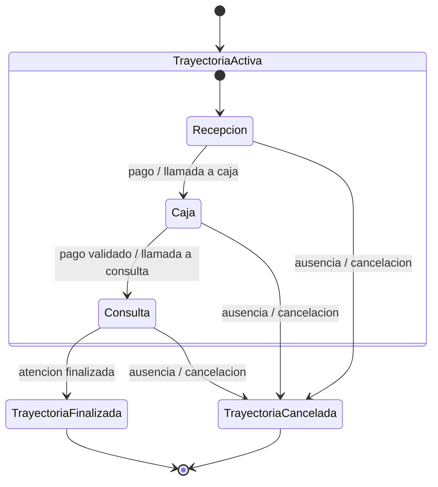

# Detailed Test Cases

## Purpose

Definir casos de prueba detallados para validar `RN-01` a `RN-30`, incluyendo invariantes, idempotencia, event ordering, concurrencia y consistencia eventual.

## Test case taxonomy

- prefijo: `TC-TRJ`
- granularidad: una regla primaria por caso
- evidencia esperada: write-side, read-side, auditoria o combinacion de estos

## 1. Unicidad y estado

| ID | Rule | Objective | Preconditions | High-level steps | Expected result | Automation target |
| --- | --- | --- | --- | --- | --- | --- |
| TC-TRJ-01 | RN-01 | validar una sola trayectoria activa por paciente | paciente sin trayectoria activa | abrir trayectoria y repetir apertura en mismo contexto | solo una trayectoria activa consolidada | unit + API |
| TC-TRJ-02 | RN-02 | impedir trayectorias duplicadas | trayectoria activa existente | reenviar apertura con contexto equivalente | no se crean registros paralelos | unit + integration |
| TC-TRJ-03 | RN-03 | evitar multiples etapas simultaneas | trayectoria en una etapa vigente | disparar dos estados incompatibles en paralelo | solo un estado operativo prevalece | integration + concurrency |
| TC-TRJ-04 | RN-04 | garantizar estado actual unico | trayectoria con varios hitos historicos | consultar detalle y snapshots | existe un solo `currentState` coherente | API + query |

## 2. Inicio y finalizacion

| ID | Rule | Objective | Preconditions | High-level steps | Expected result | Automation target |
| --- | --- | --- | --- | --- | --- | --- |
| TC-TRJ-05 | RN-05 | validar inicio con etapa valida | paciente elegible para admision | ejecutar apertura nominal | primer hito corresponde a apertura valida | unit + integration |
| TC-TRJ-06 | RN-06 | validar cierre explicito | trayectoria en flujo activo | completar atencion o marcar ausencia canonica | trayectoria termina en estado terminal explicito | E2E + API |
| TC-TRJ-07 | RN-07 | impedir estado indefinido | trayectoria activa o cerrada | inspeccionar transiciones y consultas | no aparecen estados nulos o ambiguos | unit + contract |

## 3. Transiciones

| ID | Rule | Objective | Preconditions | High-level steps | Expected result | Automation target |
| --- | --- | --- | --- | --- | --- | --- |
| TC-TRJ-08 | RN-08 | impedir transicion sin estado previo | trayectoria inexistente | intentar transicionar sin apertura valida | rechazo sin persistencia mutante | API + negative |
| TC-TRJ-09 | RN-09 | respetar flujo permitido | trayectoria en etapa conocida | ejecutar transicion valida | nuevo hito corresponde a la matriz permitida | unit + API |
| TC-TRJ-10 | RN-10 | rechazar saltos invalidos | trayectoria en etapa intermedia | intentar saltar etapas | error semantico y sin side effects | unit + API |
| TC-TRJ-11 | RN-11 | garantizar atomicidad de transicion | infraestructura operativa disponible | ejecutar transicion y observar persistencia + outbox | todo se confirma o todo falla sin estados intermedios visibles | integration |

## 4. Integridad de datos

| ID | Rule | Objective | Preconditions | High-level steps | Expected result | Automation target |
| --- | --- | --- | --- | --- | --- | --- |
| TC-TRJ-12 | RN-12 | mantener datos consistentes al cambiar de etapa | trayectoria con datos previos | transicionar entre caja y consulta | datos relevantes persisten sin corrupcion | API + E2E |
| TC-TRJ-13 | RN-13 | evitar reingreso de informacion existente | paciente con datos previamente registrados | repetir captura funcional de la misma informacion | sistema reutiliza contexto sin pedir duplicados | UI + API |
| TC-TRJ-14 | RN-14 | validar idempotencia obligatoria | clave de idempotencia controlada | reenviar mismo comando o rebuild | no se duplican hitos ni jobs | API + resilience |
| TC-TRJ-15 | RN-15 | confirmar trayectoria como fuente unica de verdad | write-side y read-side activos | comparar trayectoria con monitor y dashboard | las vistas derivan de la trayectoria y eventos asociados | integration + E2E |

## 5. Trazabilidad y auditoria

| ID | Rule | Objective | Preconditions | High-level steps | Expected result | Automation target |
| --- | --- | --- | --- | --- | --- | --- |
| TC-TRJ-16 | RN-16 | registrar historial completo | flujo completo ejecutado | consultar detalle y timeline | todos los hitos esperados estan presentes | API + audit |
| TC-TRJ-17 | RN-17 | exigir timestamp actor e identificador | eventos y queries disponibles | inspeccionar payload historico | cada hito tiene metadata minima auditable | contract + API |
| TC-TRJ-18 | RN-18 | garantizar historial inmutable | historial consolidado | intentar mutacion retroactiva | el historial no cambia | integration + negative |
| TC-TRJ-19 | RN-19 | asegurar orden cronologico | trayectoria con varias etapas | extraer y ordenar timestamps | orden monotono garantizado | API + query |
| TC-TRJ-20 | RN-20 | impedir modificaciones retroactivas | rebuild o acceso historico habilitado | reinyectar o editar evento legacy invalido | legado permanece intacto | resilience + audit |

## 6. Concurrencia y consistencia

| ID | Rule | Objective | Preconditions | High-level steps | Expected result | Automation target |
| --- | --- | --- | --- | --- | --- | --- |
| TC-TRJ-21 | RN-21 | manejar concurrencia correctamente | dos comandos compiten por misma trayectoria | ejecutar en paralelo | un camino exitoso y uno rechazado o correlacionado | concurrency |
| TC-TRJ-22 | RN-22 | validar control optimista | version inicial conocida | enviar comando con version stale | conflicto controlado, sin corrupcion | unit + integration |
| TC-TRJ-23 | RN-23 | no exponer estados intermedios visibles | transicion y projection lag controlados | consultar UI durante propagacion | UI muestra ultimo snapshot consistente, no estado parcial | UI + resilience |

## 7. Disponibilidad y tiempo real

| ID | Rule | Objective | Preconditions | High-level steps | Expected result | Automation target |
| --- | --- | --- | --- | --- | --- | --- |
| TC-TRJ-24 | RN-24 | validar estado disponible en tiempo cercano a real | snapshots y SSE activos | medir tiempo entre evento y reflejo visible | convergencia dentro del umbral operativo | performance + E2E |
| TC-TRJ-25 | RN-25 | verificar propagacion consistente de eventos | bus y projectors activos | ejecutar flujo y comparar vistas | monitor, dashboard y trayectoria convergen | integration + E2E |
| TC-TRJ-26 | RN-26 | tolerar fallos parciales | mensajeria o SSE degradados | provocar fallo y recuperar | la operacion se recupera sin perdida ni duplicacion | chaos + resilience |

## 8. Seguridad y cumplimiento

| ID | Rule | Objective | Preconditions | High-level steps | Expected result | Automation target |
| --- | --- | --- | --- | --- | --- | --- |
| TC-TRJ-27 | RN-27 | garantizar confidencialidad integridad y disponibilidad | usuarios y canales protegidos | consumir vistas y operaciones por roles | solo datos autorizados y sin corrupcion | security + API |
| TC-TRJ-28 | RN-28 | validar auditoria completa | acciones operativas ejecutadas | consultar logs y timeline | existe evidencia completa de acceso y cambio | audit + integration |
| TC-TRJ-29 | RN-29 | alinear cumplimiento normativo | datos sensibles y BFF activos | revisar session endpoints, snapshots y eventos | no hay fuga de PII ni token en browser | security + UI |
| TC-TRJ-30 | RN-30 | aplicar RBAC por roles | usuarios por rol y sin sesion | probar operaciones y vistas restringidas | `401` o `403` segun corresponda | API + UI |

## Event ordering and eventual consistency addendum

Adicionalmente, todos los casos que generen mas de un evento deben verificar:

- monotonia temporal o secuencial del historial
- ausencia de huecos imposibles entre `sourceEvent` y `currentState`
- convergencia posterior de snapshots persistidos cuando exista retraso asincronico

## Diagram - State transition model of the trajectory

> Este diagrama refleja las etapas reales del aggregate `PatientTrajectory` en codigo.
> Los sub-estados de espera (EsperaCaja, EsperaConsulta, etc.) existen dentro del aggregate `WaitingQueue`, no dentro de `PatientTrajectory`.

> **Nota**: La transicion `Recepcion → Consulta` esta bloqueada por la maquina de estados del aggregate (RN-09/RN-10). Solo se permiten transiciones secuenciales.
