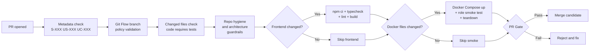

# CI/CD Pipeline

> **Actualizada**: 2026-04-09 — Basada en los 7 workflows reales de `.github/workflows/`

## Purpose

Documentar el pipeline de calidad realmente implementado en RLApp-V2, incluyendo gates por Pull Request, validacion de arquitectura, seguridad y despliegue.

## Actual Workflow Inventory

RLApp-V2 utiliza 7 workflows de GitHub Actions:

| Workflow | Archivo | Trigger | Proposito |
| --- | --- | --- | --- |
| CI | `ci.yml` | push a `main`, `develop`, `feature/**` | Validacion de documentacion canonica y capa de ejecucion Copilot |
| PR Quality Gate | `pr-quality-gate.yml` | pull_request | Metadata, Git Flow, cambios con tests, guardrails de arquitectura, build frontend condicional, smoke de roles |
| Architecture Quality | `arch-quality.yml` | push + PR (cuando cambia `apps/` o `tests/`) | Dependencias hexagonales, complejidad ciclomatica, deteccion de patrones de diseno |
| Security | `security.yml` | push, PR, weekly schedule | CodeQL SAST (C# + JS), audit de dependencias, deteccion de secretos (gitleaks) |
| Performance | `performance.yml` | workflow_dispatch (manual) | Stack Docker + k6 benchmark contra `/health/startup` |
| Commit Standards | `commit-standards.yml` | push a `feature/**`, PR | Validacion de Conventional Commits |
| Git Flow Governor | `gitflow-governor.yml` | push a `main`/`develop`, PR | Validacion de ramas source/target |

## Pipeline por PR (quality-gate)

## Gates de calidad obligatorios (reales)

### En cada PR

- Titulo y body deben referenciar `S-XXX`, `US-XXX`, `UC-XXX` y tests
- Rama source: `feature/*` o `develop`; target: `main` o `develop`
- Si hay cambios de codigo, debe haber cambios de tests correspondientes
- Arquitectura hexagonal: Domain/Application/Ports sin imports prohibidos
- Documentacion de trazabilidad existente
- Capa de ejecucion Copilot sin archivos prohibidos (`.claude/`, `AGENTS.md`)

### En cada push (CI + security + arch-quality)

- Layout canonico de documentacion validado
- CodeQL SAST para C# y JavaScript
- Audit de dependencias: `dotnet list package --vulnerable` + `npm audit`
- Deteccion de secretos con gitleaks
- Dependencias hexagonales (no imports de infra en dominio)
- Complejidad ciclomatica < 15 (via lizard)

### Manual (performance)

- Docker Compose full stack up
- k6 load test: 10 VUs, p95 < 500ms, error rate < 1%

## Artifact policy

- Reportes de complejidad ciclomatica (lizard)
- Resultados CodeQL SAST
- Resultados k6 de performance
- Reportes de audit de dependencias
- Resultados de deteccion de patrones de diseno

## Brecha conocida: Tests no automatizados en CI

> **IMPORTANTE**: Actualmente, `dotnet test` y `pnpm test` **no se ejecutan automaticamente** en el pipeline de CI. La ejecucion de tests unitarios e integracion se realiza localmente por los desarrolladores. Esto es una brecha identificada cuyo cierre elevaria significativamente la confianza del pipeline.

### Acciones recomendadas para cerrar la brecha

| Accion | Impacto | Workflow afectado |
| --- | --- | --- |
| Agregar `dotnet test` al PR quality gate | Alto | `pr-quality-gate.yml` |
| Agregar `pnpm test --run` al PR quality gate | Alto | `pr-quality-gate.yml` |
| Agregar tests de integracion con Docker en merge | Medio | `ci.yml` o nuevo workflow |

## Suggested stage ownership

| Stage | Owner |
| --- | --- |
| Documentation and traceability | engineering + AI layer |
| Architecture and complexity | backend + platform |
| Security scanning | platform + security |
| Frontend quality | frontend |
| Performance benchmarks | platform + QA |
| UI automation | QA automation |
| Contract and security validation | QA + architecture |
| Release gate | QA lead + technical lead + product |

## Release blocking conditions

- rotura de contratos de trayectoria o realtime
- inconsistencia bloqueante entre write-side y read-side
- fuga de token o bypass de rol
- p95 de convergencia fuera del objetivo acordado sin waiver formal
- ausencia de evidencia auditable para defectos criticos cerrados
