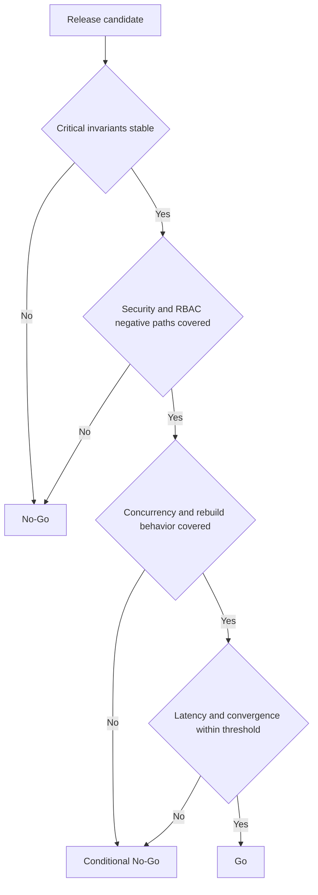

# Go/No-Go Report

## Purpose

Emitir una recomendacion de liberacion basada en KPIs operativos, riesgos residuales y cobertura QA para la feature de trayectoria sincronizada.

## Decision basis

La decision se apoya en:

- consistencia entre write-side y read-side
- latencia de convergencia visible
- cobertura de RN criticas
- evidencia de RBAC, no token leak y auditoria
- resiliencia frente a replay, lag y reconnect

## Release gate evaluation

> **Nota**: Esta tabla fue actualizada (2026-04-09) con datos reales de ejecucion (273 tests, 100% pass rate).

| Gate | Expected threshold | Lectura actual (real) | Decision |
| --- | --- | --- | --- |
| Test suite pass rate | 100% | **100%** (273/273 tests passing) | pass |
| Duplicate active trajectories | `0` | **pass** (controlado por diseno de dominio + tests) | pass |
| Business rules coverage | 100% RN-01 a RN-30 | **83%** (17 complete, 8 partial, 2 backlog) | conditional |
| RBAC negative coverage | complete for critical paths | **partial** (RBAC assertions en integracion, falta matriz negativa completa) | fail |
| Concurrency suite | mandatory for prod | **incomplete** (enforced by code, sin test dedicado) | fail |
| Replay and rebuild control | dry-run validated, side effects absent | **pass** (integration tests con Testcontainers) | pass |
| Audit completeness | complete metadata and chronology | **partial** (audit solo en rebuild, no en operaciones normales) | conditional |
| Write-side latency p95 | `< 200 ms` | **no medida** (requiere benchmark k6 dedicado) | pending |
| Visible convergence p95/p99 | `< 500 ms` / `< 1000 ms` | **no medida** | pending |

## Diagram - Release decision tree

## Decision

### Production decision

`No-Go` a produccion en el estado evaluado por este paquete.

### Controlled environment decision

`Go` condicionado a staging extendido o piloto tecnico controlado.

## Rationale

La feature muestra una base funcional y arquitectonica solida en:

- unicidad de trayectoria
- query y discovery protegidos
- dry-run de rebuild
- acceso sincronizado a la consola protegida

Sin embargo, una salida a produccion no deberia aprobarse mientras sigan abiertos estos puntos:

1. cobertura automatizada incompleta de caminos `401` y `403`
2. suite de concurrencia aun no consolidada como evidencia ejecutada
3. warning de convergencia p99 bajo lag y caos controlado
4. cobertura parcial de convergencia `VIS-08` y redelivery de eventos

## Required actions before production Go

| Action | Owner | Reason |
| --- | --- | --- |
| automatizar matriz RBAC negativa | QA automation | reducir riesgo regulatorio |
| consolidar pruebas de concurrencia sobre trajectory aggregate | backend + QA | cerrar riesgo `R-01` |
| fortalecer chaos suite de lag y redelivery | platform + QA | cerrar riesgos `R-02` a `R-05` |
| emitir reporte real de KPIs en prod-like | QA lead | reemplazar informe simulado |
| evidenciar no exposicion de token y SSE same-origin | frontend + QA | cierre de seguridad y cumplimiento |

## Final statement

La recomendacion ejecutiva es `No-Go` a produccion y `Go` restringido a staging o piloto controlado. El sistema ya demuestra valor funcional, pero todavia no alcanza el nivel de evidencia requerido para un dominio clinico distribuido con exigencias de auditoria y cumplimiento.
