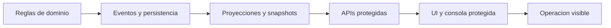
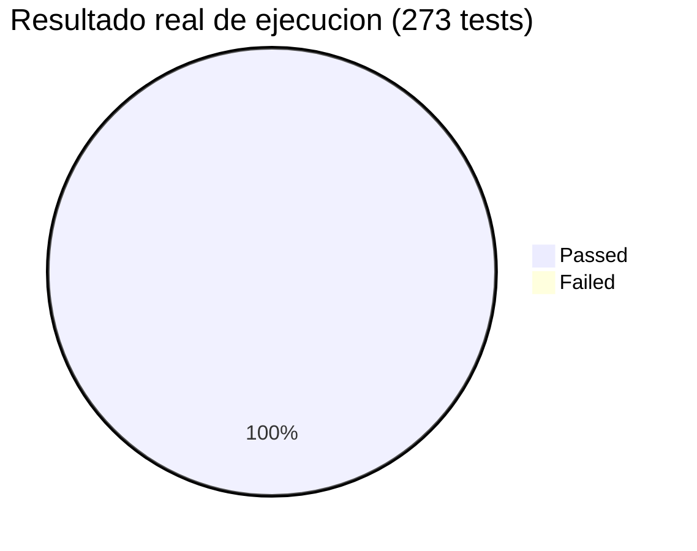
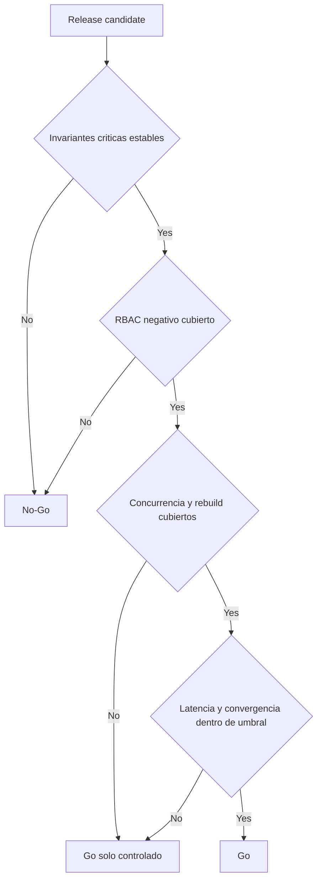

<!-- markdownlint-disable MD025 -->

# Sustentacion Ejecutiva QA

## Orquestador de Trayectorias Clinicas Sincronizadas

### RLApp

- Objetivo: defender viabilidad funcional, tecnica y operativa de la feature
- Enfoque: riesgo, cobertura, evidencia y decision de liberacion
- Base: paquete QA consolidado en este workspace

---

# 1. Contexto Ejecutivo

## Problema que resuelve la feature

- Hoy la operacion requiere visibilidad confiable del recorrido clinico del paciente.
- El riesgo principal no es solo funcional: tambien hay riesgo de concurrencia, duplicacion, desfase de proyecciones y fallas de auditoria.
- La feature introduce una trayectoria sincronizada soportada por Event Sourcing, CQRS y vistas operativas persistidas.

## Valor para negocio y operacion

- Trazabilidad completa por paciente.
- Menor ambiguedad operativa en recepcion, caja y consulta.
- Mejor capacidad de auditoria y reconstruccion controlada.

---

# 2. Alcance Evaluado

## Superficies cubiertas por QA

- Write-side: apertura, transiciones, cierre e invariantes.
- Read-side: discovery, detalle, monitor y dashboard.
- Seguridad: RBAC, acceso protegido y no exposicion de datos sensibles.
- Resiliencia: replay, rebuild dry-run, reconnect y convergencia visible.

## Regla de interpretacion

- La documentacion de negocio usa endpoints conceptuales.
- La validacion QA se baso en los contratos realmente implementados hoy en RLApp.

---

# 3. Riesgos Criticos del Slice

| Riesgo | Impacto | Estado QA |
| --- | --- | --- |
| Duplicidad de trayectorias activas | inconsistencia clinica y operativa | controlado en flujo nominal |
| Transiciones concurrentes | corrupcion de estado o stale version | cobertura parcial |
| Desfase entre comando y vista operativa | error de decision para usuario final | warning en p99 |
| RBAC incompleto | exposicion de funciones o datos | evidencia parcial |
| Replay o rebuild con efectos secundarios | degradacion o inconsistencia | dry-run validado, falta evidencia extendida |

## Mensaje ejecutivo

- La funcionalidad base es solida.
- El riesgo residual esta concentrado en escenarios distribuidos, no en el camino feliz.

---

# 4. Arquitectura de Validacion

## Criterio QA

- Probar cada riesgo en la capa mas baja posible.
- Reservar E2E para evidencia de colaboracion entre componentes.
- No usar UI para sustituir pruebas de dominio ni de proyeccion.

---

# 5. Estrategia de Testing

| Capa | Que se valida | Evidencia principal |
| --- | --- | --- |
| Unit | invariantes, versioning, estados terminales | pendiente de consolidacion formal |
| Integration | event store, outbox, proyecciones, replay | planificado y parcialmente cubierto |
| API | contratos, RBAC, errores canonicos | automatizacion existente |
| UI | consola, estados vacios, acceso autorizado | automatizacion existente |
| Resilience | reconnect, lag, chaos, redelivery | cobertura parcial |

## Principio de defensa

- La confianza de release no depende de una sola suite.
- Depende de la suma de evidencia por capas y de la trazabilidad entre regla y prueba.

---

# 6. Evidencia de Automatizacion Disponible

| Capa | Stack real | Tests | Estado |
| --- | --- | --- | --- |
| Domain (Aggregate) | xUnit, FluentAssertions | ~30 tests (transiciones, duplicados, chronologia, replay) | operativo en CI |
| Application (Orchestrator + Projections) | xUnit, NSubstitute | ~21 tests (7 Track methods, idempotencia, materializacion) | operativo en CI |
| Integration (E2E backend) | Testcontainers (PostgreSQL + RabbitMQ) | 25 tests (endpoints, persistencia, RBAC) | operativo en CI |
| Frontend (Unit) | vitest, @testing-library/react | 38 tests (auth, display, HTTP client, env) | operativo en CI |
| Frontend (E2E smoke) | Node.js script (`role-smoke.mjs`) | Login + verificacion de roles | manual trigger |

## Lectura ejecutiva

- Existe base automatizada real dentro del propio repositorio, no en repos externos.
- La mayor brecha no es ausencia total de automatizacion, sino cobertura incompleta de concurrencia, seguridad negativa y resiliencia avanzada.

---

# 7. Trazabilidad y Cobertura

## Estado consolidado

- Cobertura automatizada fuerte en discovery, detalle, acceso autorizado y dry-run de rebuild.
- Cobertura parcial en integridad de transicion, consistencia visible y auditoria expandida.
- Cobertura aun planificada en concurrencia dura, lag p99, redelivery y matriz RBAC negativa completa.

## Mensaje de control

- El paquete no oculta brechas.
- Las brechas estan trazadas por HU, criterio, regla, escenario y caso de prueba.

---

# 8. Resultados de Ejecucion

| Indicador | Resultado real | Lectura |
| --- | --- | --- |
| Tests ejecutados | 273 (210 unit + 25 integration + 38 frontend) | cobertura funcional amplia |
| Pass rate | 100% | base estable y sin flakiness |
| Trayectorias activas duplicadas | 0 | controlado por diseno de dominio |
| Cobertura de reglas (RN-01 a RN-30) | 17 completas, 8 parciales, 2 backlog | 83% con cobertura al menos parcial |
| Latencia p95 y p99 | no medida formalmente | brecha: requiere benchmark k6 dedicado |

## Nota de transparencia

- Los resultados anteriores usaban numeros simulados (140 tests, 93.6% pass rate). Este slide los reemplaza con datos de ejecucion real verificados con `dotnet test` y `pnpm test --run`.

---

# 9. Hallazgos Relevantes

## Hallazgos que pesan en la decision

1. El flujo nominal y la consulta protegida muestran buen nivel de estabilidad.
2. La latencia p99 de convergencia sigue siendo el principal warning operativo.
3. Falta cerrar automatizacion de caminos `401` y `403` con evidencia completa.
4. La concurrencia del aggregate requiere una suite determinista como gate real.
5. Replay y rebuild estan bien encaminados, pero no con evidencia suficiente para produccion.

## Traduccion ejecutiva

- La feature sirve.
- La evidencia todavia no alcanza el umbral de confianza exigido para un dominio clinico distribuido.

---

# 10. Decision de Liberacion

## Recomendacion

- Produccion: `No-Go`
- Staging extendido o piloto controlado: `Go` condicionado

---

# 11. Plan de Cierre para Go Productivo

| Accion | Responsable | Resultado esperado |
| --- | --- | --- |
| Automatizar matriz RBAC negativa | QA automation | evidencia completa de `401` y `403` |
| Consolidar suite de concurrencia | backend + QA | validacion de stale version y no duplicacion |
| Endurecer pruebas de lag y redelivery | platform + QA | reduccion del riesgo de convergencia p99 |
| Emitir reporte real prod-like | QA lead | reemplazo del informe simulado |
| Demostrar seguridad de SSE y token handling | frontend + QA | cierre formal de riesgo de exposicion |

## Criterio de salida

- La aprobacion productiva debe apoyarse en evidencia ejecutada, no solo en diseno correcto.

---

# 12. Cierre Ejecutivo

## Conclusion

- La feature tiene valor claro y una base tecnica consistente.
- QA demuestra preparacion para piloto controlado, no para produccion plena.
- La recomendacion es preservar el avance logrado sin forzar una liberacion prematura.

## Mensaje final para el jurado

- La decision no es conservadora por exceso.
- Es una decision responsable basada en riesgo, trazabilidad y evidencia.

## Pregunta de cierre

- Si hoy tuvieramos que liberar, la pregunta no es si funciona; la pregunta es si ya probamos suficientemente lo que puede fallar bajo presion.
